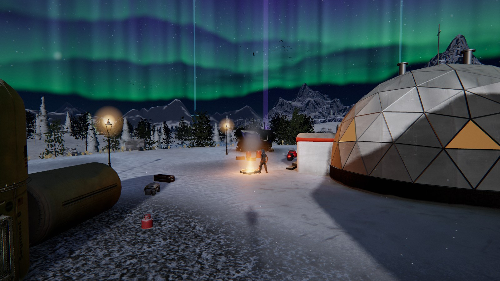
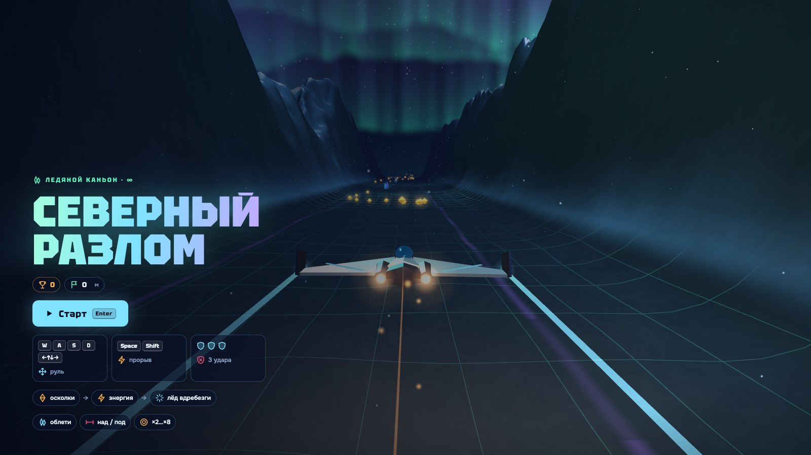
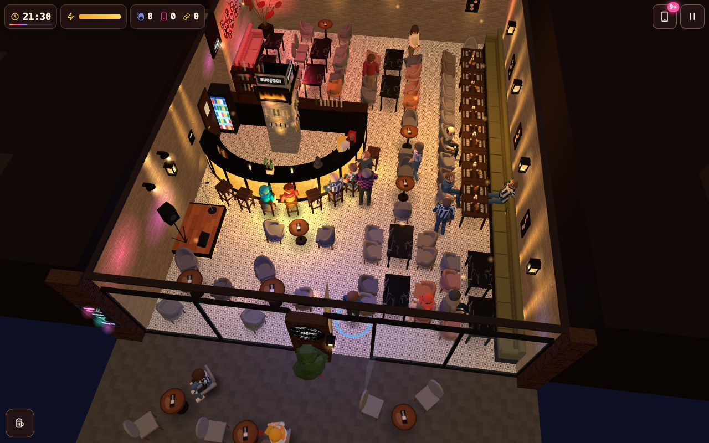
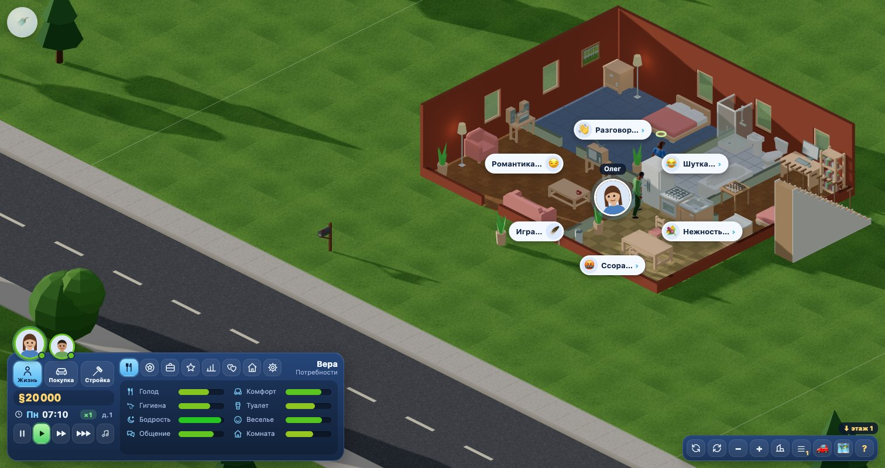

🇬🇧 **English** · [🇷🇺 Русский](README.ru.md)

### Eight complete open-source games: a medieval real-time strategy, a winter open world, a taiga survival-and-settlement game, an open-world story on a polar island, an endless ice-canyon flyer, a Saturday IT meetup in a Batumi bar, a Sims-style life sim and a game about an engineer’s job. All eight run right in your browser — or clone and play locally.

   

---

## 🎮 The games

<table>
<tr>
<td width="50%" valign="top">

### ⚔️ [Chronicles of Kingdoms](age-of-empires/)
**Medieval RTS in the spirit of Age of Empires II.**

Build a village in the Dark Age, wall it, raise a castle, reach the Imperial Age and break the enemy with trebuchets — against up to 7 AI players.

- 🏰 14 civilizations · 4 ages · 130+ technologies
- ⚔️ 75+ unit types, formations, naval warfare
- 🗺 6 random maps · 🤖 AI from Easiest to Extreme
- 🌍 7 UI languages · 💾 save / load

`JavaScript` · `Canvas 2D` · any desktop browser · also `Python` + `pygame-ce` for macOS / Windows / Linux

**[▶ Play now](https://esurvanov.github.io/awesome-games/age-of-empires/web/)** · [Python quick start](age-of-empires/README.md#-quick-start)

</td>
<td width="50%" valign="top">

### ❄️ [Berezovka](berezovka/)
**A snowbound Russian village you can walk into — 3D open world in the browser.**

Back home after five years: firewood for grandma, a 1979 Zhiguli that won't start, a missing cat past the bear, and a church bell for the holiday night.

- 🗺 ~1 km² open world · 📖 story in 12 steps
- 🚗 drivable Zhiguli with suspension and ice drift
- 🌗 day, night, northern lights, blizzards
- 🎣 ice fishing · 🪆 12 hidden matryoshkas

`three.js` · `WebGL 2` · any desktop browser, nothing to install

**[▶ Play now](https://esurvanov.github.io/awesome-games/berezovka/)**

</td>
</tr>
<tr>
<td width="50%" valign="top">

### 🐺 [Sibiria](sibiria/)
**Survive four nights in the Evenki taiga, 1993 — then build a settlement around your hut.**

Your Mi-8 went down in Evenkia and the radio is smashed. Light the stove, meet the old Evenk Urkachan, carry Vera out of the wreck, hold off the wolves and the rogue bear, and call for a helicopter — or stay and build a village.

- 🗺 ~11 × 11 km taiga in 8 zones · 👥 11 people, 15 tasks · 🦌 sledges and a «Buran»
- 📖 7 chapters · 5 endings · 🔥 real cold and a hunting wolf pack
- 🏘 hire settlers · 8 buildings · 4 ages · market and alarm bell
- 🎣 reaction fishing · 🎧 all sound synthesised · 📱 phone-ready

`JavaScript` · `Canvas 2D` · any browser, nothing to install

**[▶ Play now](https://esurvanov.github.io/awesome-games/sibiria/)**

</td>
<td width="50%" valign="top">

### 🌌 [Echo of the Rift](ekho-razloma/)
**A crashed pilot, a polar island and a rift in the ice that sings — 3D open world with a story.**

Your plane goes down under the aurora. A station AI wakes you in the wreck; an old hermit has lived here alone for eleven years. Take the three crystal spires apart, face what lives in the Rift and choose what the northern lights do next.

- 🗺 900 × 900 m island · 📖 5 chapters · 2 endings
- 👣 snow pressed by every boot, hoof and paw · ✋ the pilot leans on rocks and walls
- 🛷 a skimmer on the ice · 🦌 stags and a fox · ⚔️ a little combat
- 🤖 optional AI hermit through a local server

`three.js r186` · `WebGL 2` · any desktop browser, nothing to install

**[▶ Play now](https://esurvanov.github.io/awesome-games/ekho-razloma/open-world.html)**

</td>
</tr>
<tr>
<td width="50%" valign="top">

### 🛩 [Northern Rift](severny-razlom/)
**An endless ice canyon under the aurora — a one-file 3D arcade flyer.**

Collect shards, turn them into energy and burst through the ice walls. Weave around, over and under the obstacles for a ×8 combo before three hits bring you down.

- ♾ endless generated canyon · 💎 shards → energy → break the ice
- ✖️ combo ×2 … ×8 · 🛡 3 hits
- 🌌 everything drawn and voiced in code · 📱 touch controls

`three.js r128` · one 71 KB file · any browser

**[▶ Play now](https://esurvanov.github.io/awesome-games/severny-razlom/)**

</td>
<td width="50%" valign="top">

### 🍣 [Skhodka](skhodka/)
**A Saturday IT meetup in a real Batumi bar — meet as many people as you can and connect them.**

19:00 to 01:00 at SushiGO. You are a member of the local IT chat. Walk the hall, strike up conversations, find common topics, swap contacts and introduce people who need each other: a tester looking for a job to a lead who is hiring.

- 🍣 the real bar rebuilt in 3D: round glowing bar, gears wall, long sofa table, terrace
- 👥 ~45 guests: roles, temperaments, moods, 16 oddballs · 💬 1,100+ lines
- 🔗 six steps from «seen» to «made plans» · 📱 the meetup chat on your phone
- 🎷 sax, karaoke, rain, birthdays · 📸 group photo at the end

`three.js r158` · `vanilla JS` · any browser, double-click `index.html`

**[▶ Play now](https://www.urvanov.com/skhodka/)**

</td>
</tr>
<tr>
<td width="50%" valign="top">

### 🏡 [Zhitiyo](zhitie/)
**A life sim in the spirit of The Sims 1 — isometric 3D low-poly, a whole neighbourhood to live in.**

Move into Berёzovaya Roshcha, a neighbourhood of ten households, a park, a café, a shop, a gym and a library. Take a family, keep everyone fed and happy, hold down a job, build relationships and furnish the house — all with a fixed isometric camera.

- 🏘 10 households · 🛋 38 furniture pieces · 💞 86 social interactions
- 💼 10 careers · 🧠 8 needs driving behaviour · 🎨 low-poly CC0 3D
- 🎥 4 camera rotations × 3 zoom levels · 🌗 day/night cycle

`three.js` · `WebGL 2` · any desktop browser, nothing to install

**[▶ Play now](https://esurvanov.github.io/awesome-games/zhitie/)**

</td>
<td width="50%" valign="top">

### 📈 [Uptime](work-programmer/)
**You build a service. It breaks. You fix it. A game about an engineer’s job for people who have never coded.**

A stream of users runs through pipes: thickness is volume, colour shows whether a block copes. Place servers, caches, queues and databases, bet on what breaks first, survive the incidents and read the debrief of your decision.

- 🧭 43 levels · 5 tiers: from a single server to splitting a monolith
- 🧱 25 blocks: cache, broker, Kubernetes, sockets, VPN, sagas, monitoring, tracing
- 💥 27 incidents · 🔮 a prediction before the start · 📋 a debrief as an ADR
- 🎲 daily task, survival, sandbox · 🌐 Russian and English

`vanilla JS` · `SVG` · any browser, double-click `index.html`

**[▶ Play now](https://esurvanov.github.io/awesome-games/work-programmer/)**

</td>
</tr>
</table>

## 📸 A closer look

| Chronicles of Kingdoms | Berezovka |
|---|---|
|  |  |
|  |  |
|  |  |

## 💡 What these games have in common

| | |
|---|---|
| 🆓 **Open all the way down** | Code under MIT. Every sprite, model, texture and sound comes from open projects under CC0, CC-BY, CC BY-SA or MIT, with authors credited in each game's `CREDITS.md`. |
| 🎯 **Finished, not a demo** | Each game has a start, goals and an ending. You can play it through. |
| 📏 **Built against reality** | Numbers are checked against real ones: unit stats follow the classic RTS, and Berezovka's buildings, walking speeds and car acceleration each have an automated check. |
| 🧩 **Readable source** | No engine editor and no proprietary tools. Clone the repo and read the code. |

## 🚀 Play

| Game | How |
|---|---|
| ❄️ Berezovka | Open **[esurvanov.github.io/awesome-games/berezovka](https://esurvanov.github.io/awesome-games/berezovka/)** — or `cd berezovka && python3 -m http.server` |
| 🐺 Sibiria | Open **[esurvanov.github.io/awesome-games/sibiria](https://esurvanov.github.io/awesome-games/sibiria/)** — or `cd sibiria && python3 -m http.server` |
| 🍣 Skhodka | Open **[urvanov.com/skhodka](https://www.urvanov.com/skhodka/)** — or double-click `skhodka/index.html` |
| 🛩 Northern Rift | Open **[esurvanov.github.io/awesome-games/severny-razlom](https://esurvanov.github.io/awesome-games/severny-razlom/)** — or double-click `severny-razlom/index.html` |
| 🌌 Echo of the Rift | Open **[esurvanov.github.io/awesome-games/ekho-razloma](https://esurvanov.github.io/awesome-games/ekho-razloma/open-world.html)** — or `cd ekho-razloma && python3 -m http.server` and open `/open-world.html` |
| ⚔️ Chronicles of Kingdoms | Open **[esurvanov.github.io/awesome-games/age-of-empires](https://esurvanov.github.io/awesome-games/age-of-empires/web/)** — or `python3 -m http.server` in the repo root and open `/age-of-empires/web/`; Python version: `cd age-of-empires && python3 -m venv .venv && .venv/bin/pip install pygame-ce numpy && .venv/bin/python main.py` (macOS: double-click `Play.command`) |
| 🏡 Zhitiyo | Open **[esurvanov.github.io/awesome-games/zhitie](https://esurvanov.github.io/awesome-games/zhitie/)** — or `cd zhitie && ./serve.sh` |
| 📈 Uptime | Open **[esurvanov.github.io/awesome-games/work-programmer](https://esurvanov.github.io/awesome-games/work-programmer/)** — or double-click `work-programmer/index.html` |

## 📜 Licence

Code — MIT, see each game's `LICENSE`. Art and sound keep their original licences, listed in [age-of-empires/CREDITS.md](age-of-empires/CREDITS.md), [berezovka/CREDITS.md](berezovka/CREDITS.md), [ekho-razloma/CREDITS.md](ekho-razloma/CREDITS.md) and [zhitie/CREDITS.md](zhitie/CREDITS.md).
