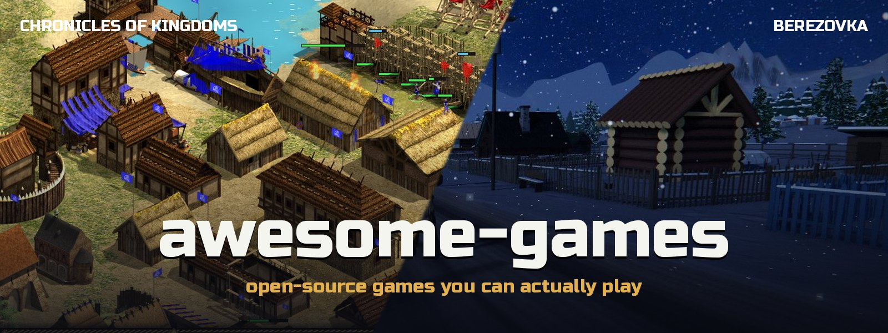
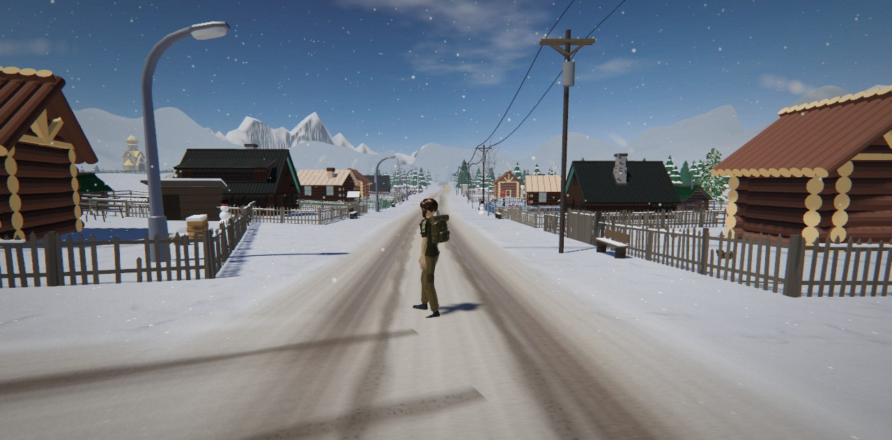
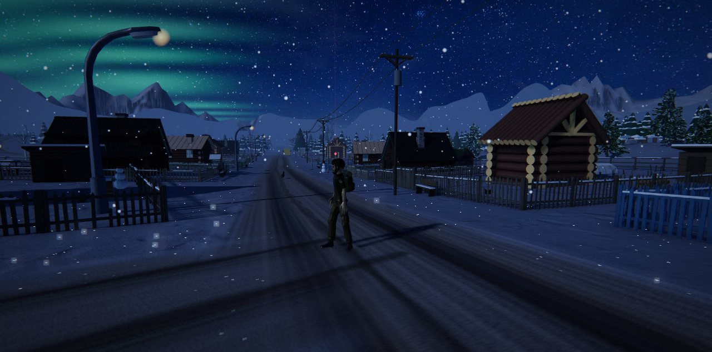
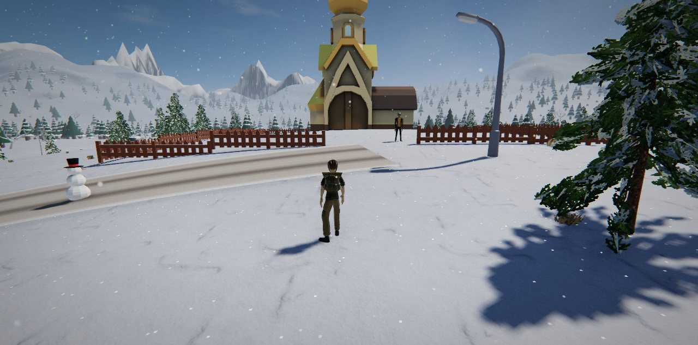
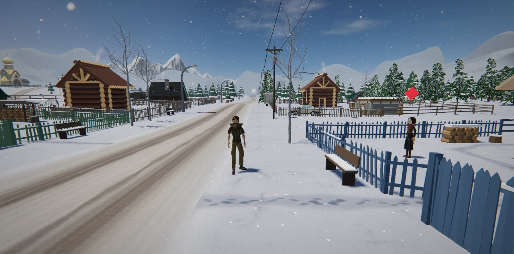

[🇬🇧 English](README.md) · 🇷🇺 **Русский**

### Три законченные открытые игры: средневековая стратегия в реальном времени, зимний открытый мир и игра-выживание с посёлком в тайге. Все три запускаются прямо в браузере — или скачайте и играйте локально.

   

---

## 🎮 Игры

<table>
<tr>
<td width="50%" valign="top">

### ⚔️ [Хроники Королевств](age-of-empires/)
**Средневековая стратегия в духе Age of Empires II.**

Постройте деревню в Тёмные века, обнесите стеной, возведите замок, дойдите до Имперской эпохи и сломите врага требушетами — против семи противников под управлением компьютера.

- 🏰 14 цивилизаций · 4 эпохи · 130+ технологий
- ⚔️ 75+ видов войск, построения, морские бои
- 🗺 6 случайных карт · 🤖 шесть уровней сложности
- 🌍 7 языков · 💾 сохранения

`JavaScript` · `Canvas 2D` · любой браузер на компьютере · есть и версия на `Python` + `pygame-ce` для macOS / Windows / Linux

**[▶ Играть](https://hedgehogues.github.io/awesome-games/age-of-empires/web/)** · [запуск версии на Python](age-of-empires/README.ru.md)

</td>
<td width="50%" valign="top">

### ❄️ [Берёзовка](berezovka/README.ru.md)
**Заснеженная русская деревня, в которую можно войти: 3D-мир прямо в браузере.**

Домой через пять лет: дрова для бабушки, дедова «копейка» 79-го, которая не заводится, пропавший кот за медвежьим углом и колокол для праздничной ночи.

- 🗺 открытый мир около 1 км² · 📖 сюжет из 12 шагов
- 🚗 «копейка» с подвеской и заносом на льду
- 🌗 день, ночь, северное сияние, метели
- 🎣 подлёдная рыбалка · 🪆 12 спрятанных матрёшек

`three.js` · `WebGL 2` · любой браузер на компьютере, ничего не устанавливать

**[▶ Играть](https://hedgehogues.github.io/awesome-games/berezovka/)**

</td>
</tr>
<tr>
<td colspan="2" valign="top">

### 🐺 [Сибирь](sibiria/README.ru.md)

**Переживи четыре ночи в эвенкийской тайге, 1993 год, — и построй посёлок вокруг своей избы.**

Твой Ми-8 упал в Эвенкии, рация разбита. Растопи печь, найди старика-эвенка Уркачана, вытащи Веру из обломков, отбейся от волков и шатуна и вызови вертолёт — или останься и построй посёлок.

- 📖 4 главы · 4 концовки · 🔥 настоящий холод и стая, которая охотится
- 🏘 нанимай поселенцев · 8 зданий · 4 эпохи · рынок и набат
- 🎣 рыбалка на реакцию · 🎧 весь звук синтезируется · 📱 работает на телефоне

`JavaScript` · `Canvas 2D` · любой браузер, ничего ставить не нужно

**[▶ Играть](https://hedgehogues.github.io/awesome-games/sibiria/)**

</td>
</tr>
</table>

## 📸 Ближе

| Хроники Королевств | Берёзовка |
|---|---|
|  |  |
|  |  |
|  |  |

## 💡 Что у них общего

| | |
|---|---|
| 🆓 **Открыто до последнего файла** | Код под MIT. Спрайты, модели, текстуры и звуки — из открытых проектов под CC0, CC-BY, CC BY-SA и MIT, авторы указаны в `CREDITS.md` каждой игры. |
| 🎯 **Законченные игры** | У каждой есть начало, цели и финал. Их можно пройти. |
| 📏 **Сверено с реальностью** | Цифры проверены по настоящим: войска — по классической стратегии, а у Берёзовки размеры построек, скорость шага и разгон машины проверяются автоматически. |
| 🧩 **Читаемый код** | Без редакторов движков и закрытых инструментов. Скачайте репозиторий и читайте код. |

## 🚀 Как играть

| Игра | Как |
|---|---|
| ❄️ Берёзовка | Откройте **[hedgehogues.github.io/awesome-games/berezovka](https://hedgehogues.github.io/awesome-games/berezovka/)** — или `cd berezovka && python3 -m http.server` |
| 🐺 Сибирь | Откройте **[hedgehogues.github.io/awesome-games/sibiria](https://hedgehogues.github.io/awesome-games/sibiria/)** — или `cd sibiria && python3 -m http.server` |
| ⚔️ Хроники Королевств | Откройте **[hedgehogues.github.io/awesome-games/age-of-empires](https://hedgehogues.github.io/awesome-games/age-of-empires/web/)** — или `python3 -m http.server` в корне репозитория и откройте `/age-of-empires/web/`; версия на Python: `cd age-of-empires && python3 -m venv .venv && .venv/bin/pip install pygame-ce numpy && .venv/bin/python main.py` (на macOS — двойной клик по `Play.command`) |

## 📜 Лицензии

Код — MIT, см. `LICENSE` каждой игры. Графика и звук — под исходными лицензиями, список в [age-of-empires/CREDITS.md](age-of-empires/CREDITS.md) и [berezovka/CREDITS.md](berezovka/CREDITS.md).
