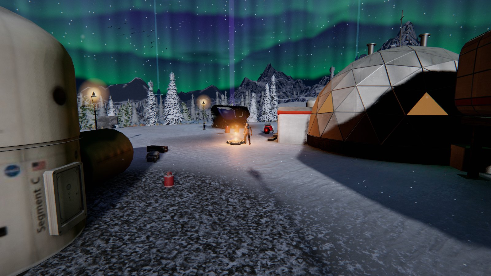
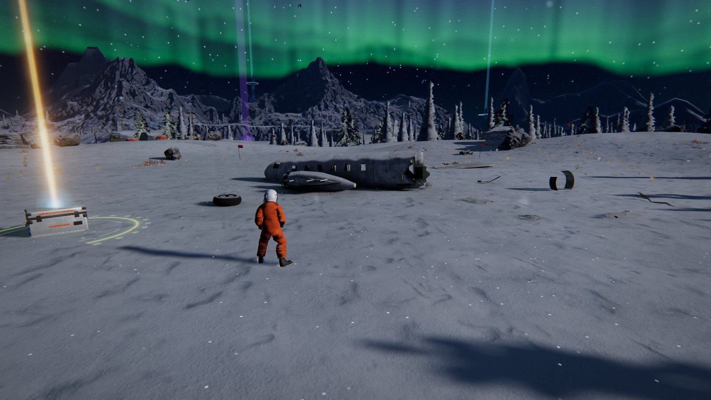
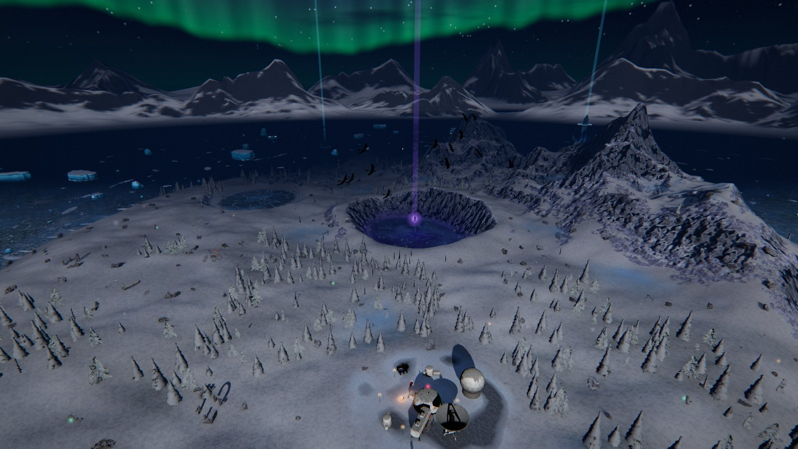

[🇬🇧 English](README.md) · 🇷🇺 **Русский**

# Эхо Разлома

**Разбившийся пилот, полярный остров и светящийся разлом во льду — 3D-игра с открытым миром и сюжетом прямо в браузере. Ничего не нужно устанавливать.**

Самолёт «Кестрел» падает на безымянный полярный остров под северным сиянием. В обломках тебя будит ИИ станции ИРИС. Отшельник Орм одиннадцать лет живёт здесь один, рядом с разломом во льду, который поёт. Найди резак, доберись до станции, разбери три кристальных шпиля, встреться с тем, что живёт в Разломе, — и реши, что станет с сиянием.

## ✨ Что внутри

| | | |
|---|---|---|
| 🗺 **Открытый остров 900 × 900 м** — место крушения, станция, озеро, руины, лес, морской лёд, Разлом | 📖 **5 глав, 2 финала** — диалоги с выбором, 8 записей эха, 24 осколка | 🛷 **Скиммер** — зови на T, катайся по льду |
| 👣 **Снег, который помнит** — ботинок, копыто и лапа продавливают снег своей формой, кувырок оставляет полосу | ✋ **Касания** — пилот опирается о камни и стены, упирается на склоне, перелезает низкие препятствия | 🦌 **Звери** — олени шагом, рысью и галопом, лиса идёт следом |
| 🌌 **Ночь как ночь** — сияние, лунные тени, запечённый свет, туман, падающий снег | ⚔️ **Немного боёв** — кристальные осколыши и голем в Разломе | 🤖 **ИИ по желанию** — с локальным сервером отшельник отвечает на то, что ты пишешь; без него работают правила |

## 🎮 Управление

| | |
|---|---|
| `W A S D` идти · `Shift` бег · `Space` прыжок · `C` кувырок | `E` действие · `ЛКМ` резак · `Q` скан · `G` привет |
| `T` скиммер · `M` карта · `J` журнал · `Esc` пауза | `Y` говорить с Ормом · `V` команда ИРИС (с локальным ИИ-сервером) |

## 🚀 Запустить у себя

| | |
|---|---|
| В браузере | **[esurvanov.github.io/awesome-games/ekho-razloma/open-world.html](https://esurvanov.github.io/awesome-games/ekho-razloma/open-world.html)** |
| Локально | `cd ekho-razloma && python3 -m http.server` → `http://localhost:8000/open-world.html` |
| С ИИ-отшельником | `node server/server.mjs --page open-world.html --open`, ключ `TYPESAFE_API_KEY=…` в `.env` (не коммитить) |
| Бонус | [Северный Разлом](../severny-razlom/README.ru.md) — полёт по каньону, первая игра в этом мире (здесь же `index.html`) |

Любой браузер на компьютере с WebGL 2. Качество подстраивается под машину.

## 📸 Ещё

| | |
|---|---|
|  |  |

## 📜 Лицензия

Код — MIT ([LICENSE](LICENSE)). Модели, текстуры, анимации и фото-референсы — под своими лицензиями, см. [CREDITS.md](CREDITS.md).
