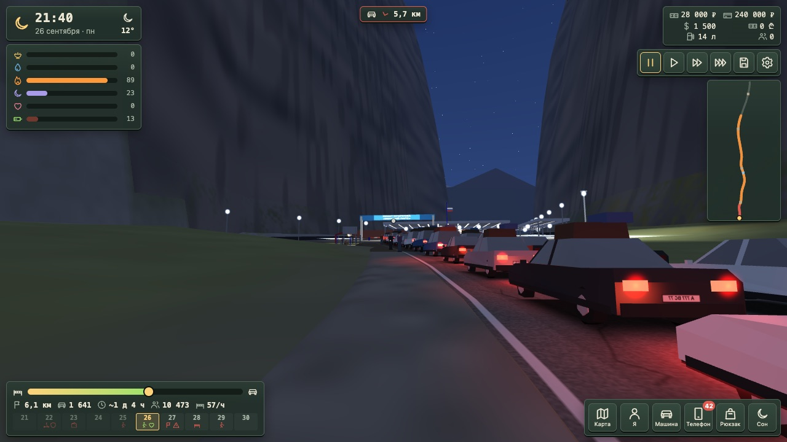

[🇬🇧 English](README.md) · 🇷🇺 **Русский**

### Семь законченных открытых игр: средневековая стратегия в реальном времени, зимний открытый мир, игра-выживание с посёлком в тайге, история очереди на Верхнем Ларсе в 2022 году от первого лица, сюжетный открытый мир на полярном острове бесконечный полёт по ледяному каньону и субботняя IT-сходка в баре Батуми. Все семь запускаются прямо в браузере — или скачайте и играйте локально.

   

---

## 🎮 Игры

<table>
<tr>
<td width="50%" valign="top">

### ⚔️ [Хроники Королевств](age-of-empires/)
**Средневековая стратегия в духе Age of Empires II.**

Постройте деревню в Тёмные века, обнесите стеной, возведите замок, дойдите до Имперской эпохи и сломите врага требушетами — против семи противников под управлением компьютера.

- 🏰 14 цивилизаций · 4 эпохи · 130+ технологий
- ⚔️ 75+ видов войск, построения, морские бои
- 🗺 6 случайных карт · 🤖 шесть уровней сложности
- 🌍 7 языков · 💾 сохранения

`JavaScript` · `Canvas 2D` · любой браузер на компьютере · есть и версия на `Python` + `pygame-ce` для macOS / Windows / Linux

**[▶ Играть](https://esurvanov.github.io/awesome-games/age-of-empires/web/)** · [запуск версии на Python](age-of-empires/README.ru.md)

</td>
<td width="50%" valign="top">

### ❄️ [Берёзовка](berezovka/README.ru.md)
**Заснеженная русская деревня, в которую можно войти: 3D-мир прямо в браузере.**

Домой через пять лет: дрова для бабушки, дедова «копейка» 79-го, которая не заводится, пропавший кот за медвежьим углом и колокол для праздничной ночи.

- 🗺 открытый мир около 1 км² · 📖 сюжет из 12 шагов
- 🚗 «копейка» с подвеской и заносом на льду
- 🌗 день, ночь, северное сияние, метели
- 🎣 подлёдная рыбалка · 🪆 12 спрятанных матрёшек

`three.js` · `WebGL 2` · любой браузер на компьютере, ничего не устанавливать

**[▶ Играть](https://esurvanov.github.io/awesome-games/berezovka/)**

</td>
</tr>
<tr>
<td width="50%" valign="top">

### 🐺 [Сибирь](sibiria/README.ru.md)
**Переживи четыре ночи в эвенкийской тайге, 1993 год, — и построй посёлок вокруг своей избы.**

Твой Ми-8 упал в Эвенкии, рация разбита. Растопи печь, найди старика-эвенка Уркачана, вытащи Веру из обломков, отбейся от волков и шатуна и вызови вертолёт — или останься и построй посёлок.

- 🗺 ~11 × 11 км тайги, 8 зон · 👥 11 жителей, 15 заданий · 🦌 упряжки и «Буран»
- 📖 7 глав · 5 концовок · 🔥 настоящий холод и стая, которая охотится
- 🏘 нанимай поселенцев · 8 зданий · 4 эпохи · рынок и набат
- 🎣 рыбалка на реакцию · 🎧 весь звук синтезируется · 📱 работает на телефоне

`JavaScript` · `Canvas 2D` · любой браузер, ничего ставить не нужно

**[▶ Играть](https://esurvanov.github.io/awesome-games/sibiria/)**

</td>
<td width="50%" valign="top">

### 🏔 [Ларс](lars/README.ru.md)
**Сентябрь 2022-го, очередь на КПП Верхний Ларс — проживи её от первого лица.**

Ты — Артём, 27 лет, программист, один в машине до Тбилиси. Впереди 25 км очереди по Дарьяльскому ущелью, тысячи незнакомых людей и десять дней. В игре нет злодеев и нет чьей-то стороны.

- 🚗 очередь 25 км · ~4 000 машин · ~12 000 человек · реальные цифры по дням
- 🥪 еда, вода, тепло, сон, нервы, заряд · 💸 ₽ / $ / ₾, цены растут по часам
- 📣 слухи · 📱 телефон и чаты · 👥 люди с хорошим и плохим
- 🏔 Дарьяльское ущелье на WebGL вручную · 🔊 голоса по желанию

`WebGL` · `чистый JS` · любой браузер, двойной щелчок по `index.html`

**[▶ Играть](https://www.urvanov.com/lars/)**

</td>
</tr>
<tr>
<td width="50%" valign="top">

### 🌌 [Эхо Разлома](ekho-razloma/README.ru.md)
**Разбившийся пилот, полярный остров и поющий разлом во льду — 3D открытый мир с сюжетом.**

Самолёт падает под сиянием. ИИ станции будит тебя в обломках, старый отшельник живёт здесь один одиннадцать лет. Разбери три кристальных шпиля, встреться с тем, что живёт в Разломе, и реши, что станет с сиянием.

- 🗺 остров 900 × 900 м · 📖 5 глав · 2 финала
- 👣 снег продавливается каждым ботинком, копытом и лапой · ✋ пилот опирается о камни и стены
- 🛷 скиммер по льду · 🦌 олени и лиса · ⚔️ немного боёв
- 🤖 ИИ-отшельник по желанию, через локальный сервер

`three.js r186` · `WebGL 2` · любой браузер на компьютере, ничего не нужно устанавливать

**[▶ Играть](https://esurvanov.github.io/awesome-games/ekho-razloma/open-world.html)**

</td>
<td width="50%" valign="top">

### 🛩 [Северный Разлом](severny-razlom/README.ru.md)
**Бесконечный ледяной каньон под сиянием — 3D-аркада в одном файле.**

Собирай осколки, копи энергию и пробивай ледяные стены. Облетай препятствия, проходи над ними и под ними ради множителя ×8, пока три удара не собьют корабль.

- ♾ бесконечный каньон · 💎 осколки → энергия → лёд вдребезги
- ✖️ множитель ×2 … ×8 · 🛡 3 удара
- 🌌 картинка и звук — всё кодом · 📱 сенсорное управление

`three.js r128` · один файл 71 КБ · любой браузер

**[▶ Играть](https://esurvanov.github.io/awesome-games/severny-razlom/)**

</td>
</tr>
<tr>
<td width="50%" valign="top">

### 🍣 [Сходка](skhodka/README.ru.md)
**Субботняя IT-сходка в настоящем баре Батуми — познакомься с как можно большим числом людей и сведи их между собой.**

С 19:00 до 01:00 в SushiGO. Ты участник местного IT-чата. Ходи по залу, заговаривай, ищи общие темы, обменивайся контактами и своди тех, кто нужен друг другу: тестировщика, который ищет работу, с тимлидом, который нанимает.

- 🍣 настоящий бар в 3D: круглая светящаяся стойка, стена с шестерёнками, длинный стол у дивана, веранда
- 👥 ~45 гостей: роли, характеры, настроения, 16 чудиков · 💬 1100+ реплик
- 🔗 шесть ступеней от «видел» до «договорились» · 📱 чат сходки в телефоне
- 🎷 саксофон, караоке, дождь, дни рождения · 📸 общее фото в конце

`three.js r158` · `vanilla JS` · любой браузер, двойной щелчок по `index.html`

**[▶ Играть](https://www.urvanov.com/skhodka/)**

</td>
<td width="50%" valign="top">
</td>
</tr>
</table>

## 📸 Ближе

| Хроники Королевств | Берёзовка |
|---|---|
|  |  |
|  |  |
|  |  |

## 💡 Что у них общего

| | |
|---|---|
| 🆓 **Открыто до последнего файла** | Код под MIT. Спрайты, модели, текстуры и звуки — из открытых проектов под CC0, CC-BY, CC BY-SA и MIT, авторы указаны в `CREDITS.md` каждой игры. |
| 🎯 **Законченные игры** | У каждой есть начало, цели и финал. Их можно пройти. |
| 📏 **Сверено с реальностью** | Цифры проверены по настоящим: войска — по классической стратегии, у Берёзовки размеры построек, скорость шага и разгон машины проверяются автоматически, а очередь в Ларсе идёт по реальным цифрам по дням. |
| 🧩 **Читаемый код** | Без редакторов движков и закрытых инструментов. Скачайте репозиторий и читайте код. |

## 🚀 Как играть

| Игра | Как |
|---|---|
| ❄️ Берёзовка | Откройте **[esurvanov.github.io/awesome-games/berezovka](https://esurvanov.github.io/awesome-games/berezovka/)** — или `cd berezovka && python3 -m http.server` |
| 🐺 Сибирь | Откройте **[esurvanov.github.io/awesome-games/sibiria](https://esurvanov.github.io/awesome-games/sibiria/)** — или `cd sibiria && python3 -m http.server` |
| 🏔 Ларс | Откройте **[urvanov.com/lars](https://www.urvanov.com/lars/)** — или двойной щелчок по `lars/index.html` |
| 🍣 Сходка | Откройте **[urvanov.com/skhodka](https://www.urvanov.com/skhodka/)** — или двойной щелчок по `skhodka/index.html` |
| 🛩 Северный Разлом | Откройте **[esurvanov.github.io/awesome-games/severny-razlom](https://esurvanov.github.io/awesome-games/severny-razlom/)** — или двойной щелчок по `severny-razlom/index.html` |
| 🌌 Эхо Разлома | Откройте **[esurvanov.github.io/awesome-games/ekho-razloma](https://esurvanov.github.io/awesome-games/ekho-razloma/open-world.html)** — или `cd ekho-razloma && python3 -m http.server` и откройте `/open-world.html` |
| ⚔️ Хроники Королевств | Откройте **[esurvanov.github.io/awesome-games/age-of-empires](https://esurvanov.github.io/awesome-games/age-of-empires/web/)** — или `python3 -m http.server` в корне репозитория и откройте `/age-of-empires/web/`; версия на Python: `cd age-of-empires && python3 -m venv .venv && .venv/bin/pip install pygame-ce numpy && .venv/bin/python main.py` (на macOS — двойной клик по `Play.command`) |

## 📜 Лицензии

Код — MIT, см. `LICENSE` каждой игры. Графика и звук — под исходными лицензиями, список в [age-of-empires/CREDITS.md](age-of-empires/CREDITS.md) и [berezovka/CREDITS.md](berezovka/CREDITS.md) и [ekho-razloma/CREDITS.md](ekho-razloma/CREDITS.md).
