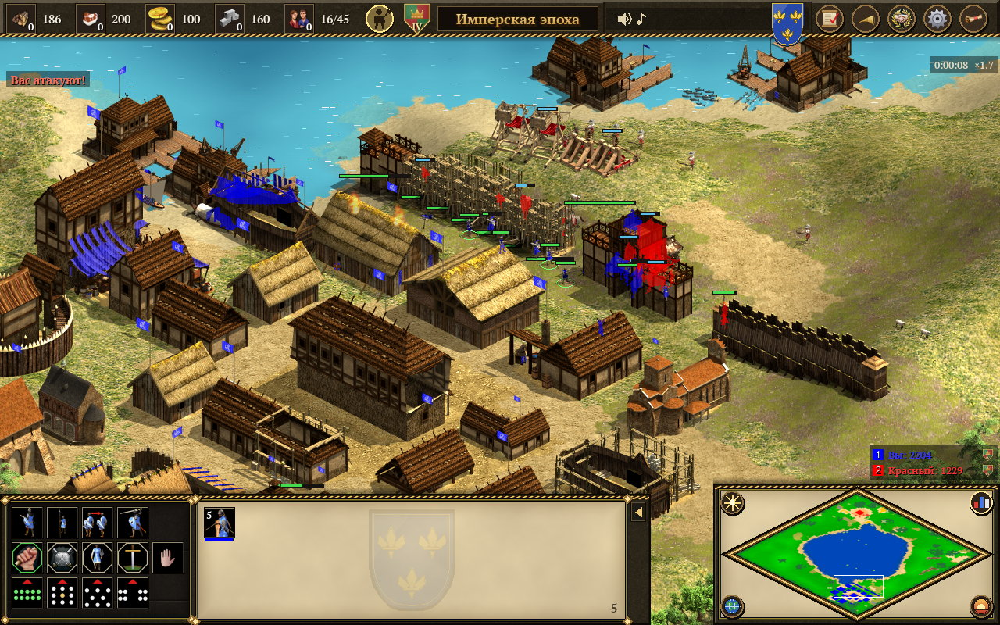
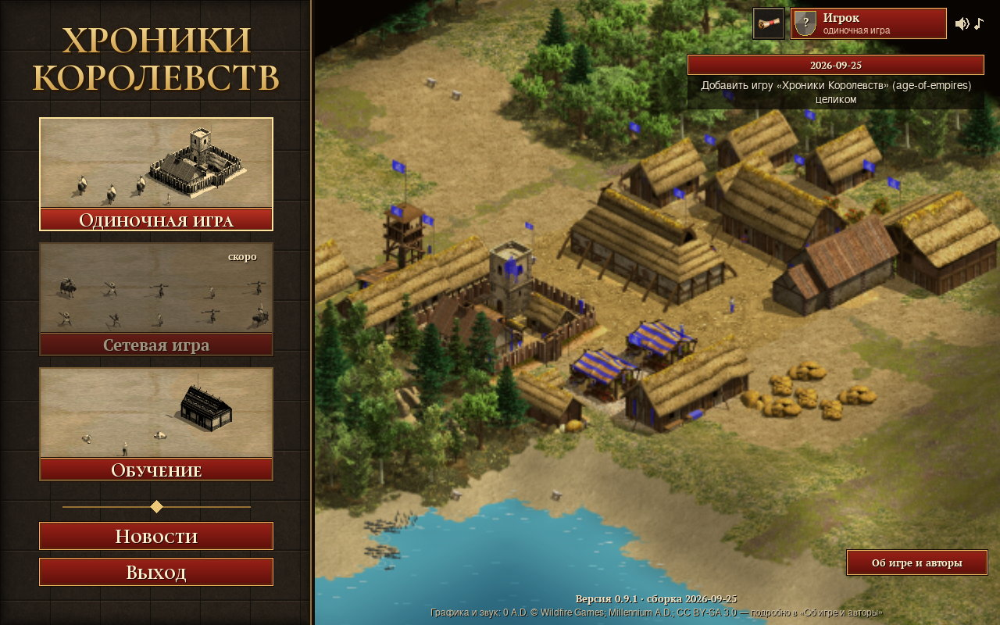
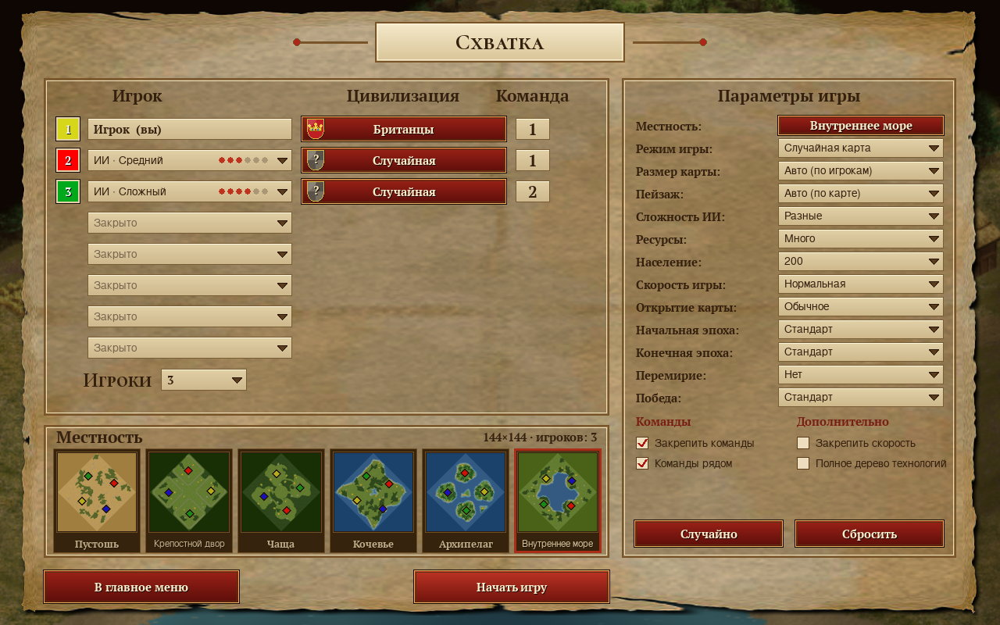
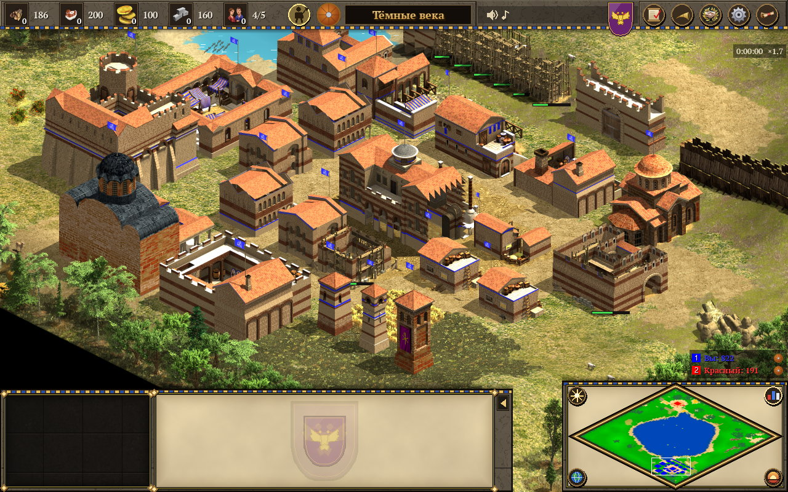
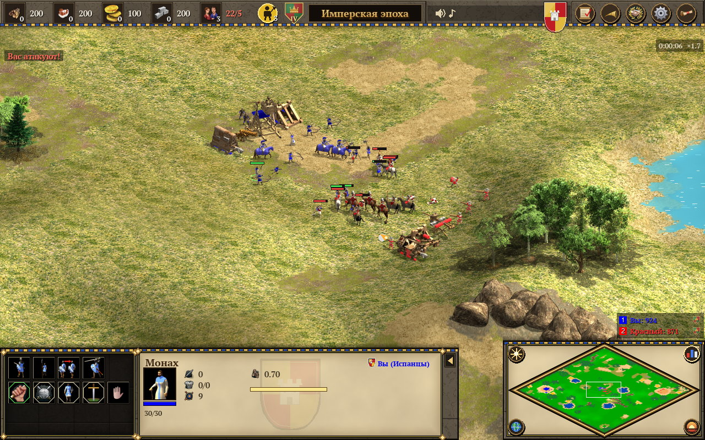
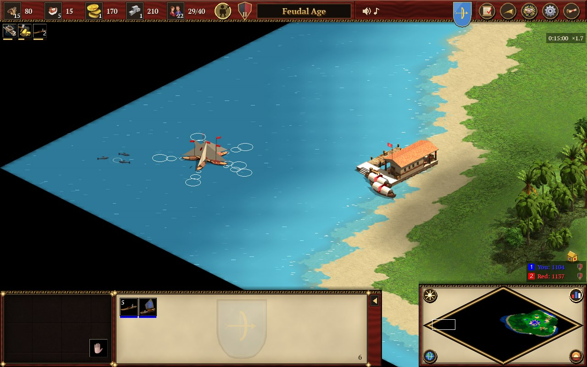
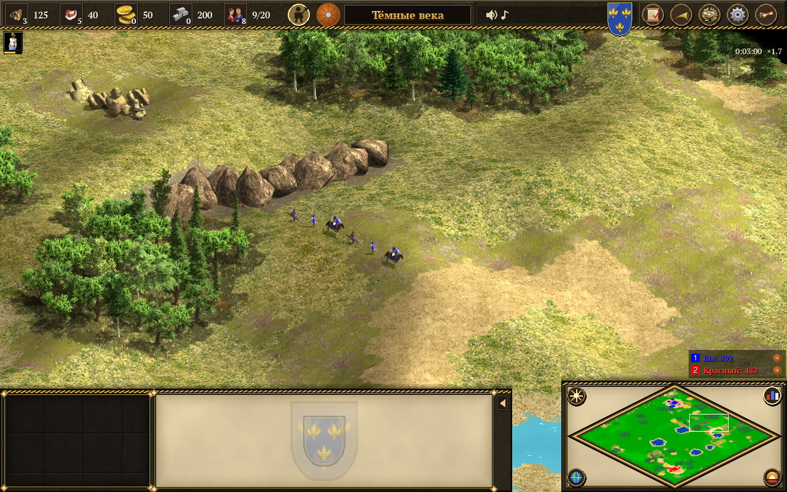
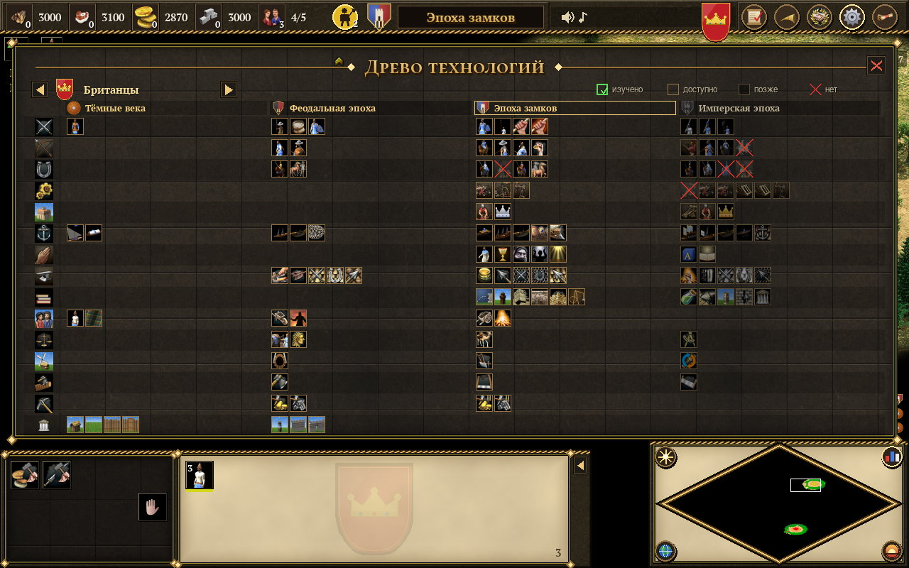
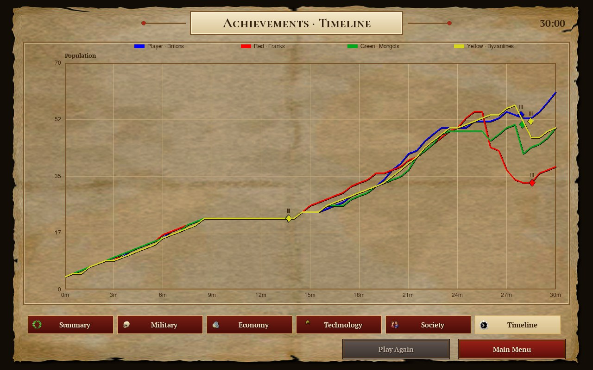

<div align="center">

[🇬🇧 English](README.md) · 🇷🇺 **Русский**

# Хроники Королевств

**Открытая средневековая стратегия в реальном времени в духе Age of Empires II — Python, изометрия, чистые лицензии.**

[](https://www.python.org/)
[](https://pyga.me/)
[](LICENSE)
[](CREDITS.md)
[](#-быстрый-старт)
[](#-возможности)



</div>

Поставьте деревню в Тёмные века, обнесите стеной, поднимите замок, дойдите по древу технологий до Имперской эпохи и проломите врага требушетами — против семи компьютерных игроков, на шести случайных картах в духе DE, за одну из 14 цивилизаций. Правила и числа близки к классике; каждый спрайт, звук и нота — из открытых проектов (0 A.D., Millennium A.D.) или наша процедурная работа.

## ✨ Возможности

| | | |
|---|---|---|
| 🏰 **14 цивилизаций** — уникальные юниты, технологии, командные бонусы | 🕰 **4 эпохи** — Тёмные века · Феодальная · Замков · Имперская | 🌳 **Полное древо технологий** — 130+ технологий, F5 в игре |
| ⚔️ **75+ видов юнитов** — пехота, стрелки, конница, осада, монахи, корабли | 💰 **Экономика** — рынок, торговые повозки, реликвии, фермы | 🧱 **Стены, ворота, башни, гарнизон** — ремонт, набат |
| 🎖 **Строи и стойки** — линия, коробка, шахматный, фланг · от агрессивной до «не атаковать» | 🚢 **Флот** — доки, рыбалка, транспорты, галеры, брандеры | 🗺 **6 случайных карт** — Пустошь, Крепостной двор, Чаща, Кочевье, Архипелаг, Внутреннее море |
| ⛰ **Рельеф** — холмы, обрывы, мелководье, 6 пейзажей | 🤖 **ИИ** — 6 уровней, от Легчайшего до Экстрима | 👥 **До 8 игроков**, команды, дипломатия, чат, сигналы на мини-карте |
| 💾 **Сохранение / загрузка** — слоты и быстрое (F7/F8) | 📊 **Статистика после партии** — 6 вкладок, график | 🌍 **7 языков интерфейса** — en, ru, de, fr, es, pt-BR, it |
| 🎨 **Графика** — 3D-модели, отрендеренные в изометрические спрайты, + процедурные значки | 🎵 **Музыка и голоса** — из 0 A.D., плюс процедурные средневековые пьесы | 🖥 **Окно 1280×800**, зум колесом ×0,6–1,6 |

## 📸 Снимки

| Главное меню | Лобби схватки |
|---|---|
|  |  |
| **Византийский город** | **Бой в поле с осадными орудиями** |
|  |  |
| **Архипелаг: флот и док** | **Холмы и обрывы** |
|  |  |
| **Древо технологий** | **Статистика после партии** |
|  |  |

## 🚀 Быстрый старт

**macOS** — двойной щелчок по `Play.command` (при первом запуске создаёт окружение и ставит зависимости).

**Все платформы:**

```bash
python3 -m venv .venv
.venv/bin/pip install pygame-ce numpy        # Windows: .venv\Scripts\pip
.venv/bin/python main.py                     # Windows: .venv\Scripts\python main.py
```

| Требование | |
|---|---|
| 🐍 Python | 3.12 и новее |
| 📦 Пакеты | `pygame-ce`, `numpy` (numpy — процедурный звук; без него игра идёт молча) |
| 🧠 Память | 4 ГБ |
| 💽 Диск | ~300 МБ (ассеты ≈ 210 МБ + окружение) |

## 🌐 Игра в браузере

Вся игра также работает в браузере как обычный статический сайт: без серверного кода, без сборки и установки.
Браузерная версия лежит в `web/` (JavaScript ES-модули, Canvas 2D, Web Audio, сохранения в IndexedDB) и читает те же `assets/`.

| Где | Как |
|---|---|
| 💻 Локально | из корня репозитория: `python3 -m http.server 8000`, затем открыть <http://localhost:8000/web/> (подойдёт любой статический сервер: `npx serve`, nginx, …) |
| 🌍 GitHub Pages | Settings → Pages → *Deploy from a branch* → `main`, папка `/ (root)`; игра по адресу `https://<user>.github.io/<repo>/` (перенаправит в `web/`) |
| 🗂 Любой статический хостинг | выложить репозиторий как есть (минимум `web/`, `assets/`, `CREDITS.md`, `index.html`, `.nojekyll`) и открыть `web/` |

| Важно | |
|---|---|
| 📂 `file://` | не работает: браузеры не грузят ES-модули с локального диска — нужен любой статический сервер |
| ⏳ Первый запуск | скачивает ≈ 65 МБ (интерфейс, местность, здания, портреты); спрайты юнитов и музыка подгружаются по мере надобности |
| 💾 Сохранения, настройки | хранятся в этом браузере (IndexedDB), отдельно от `~/.cache/khroniki` Python-версии |
| 🧪 Проверки | `node --test web/tests/test_*.mjs` (логика против CPython, включая партию ИИ против ИИ шаг в шаг) · `node web/tests/e2e.mjs` (headless Chromium: меню → схватка → стройка → сохранение/загрузка → настройки → выход) |

## 🎮 Управление

| Клавиши | Действие |
|---|---|
| **ЛКМ** / рамка · двойной клик | выбрать · все такие же на экране (не больше 60) |
| **ПКМ** | идти · добывать · строить · бить · в гарнизон (Alt+ПКМ по зданию) |
| **Q W E R T / A S D F G / Z X C V B** | сетка панели команд (житель: **Q** экономика, **W** военные здания) |
| **Shift** + постройка / обучение / приказ | несколько фундаментов · 5 юнитов · очередь приказов (маршрут) |
| **Ctrl+1…9** · **1…9** · **Shift+1…9** | назначить группу · выбрать (дважды → камера) · добавить к выбору; Alt → группы 10–19 |
| **H** · **Ctrl+B/A/L/K/D/Y/C/M/S/U/N/E/I/T** | городской центр · к казарме, стрельбищу, конюшне, мастерской, доку, монастырю, замку, рынку, кузнице, университету, мельнице, лесопилке, шахте, башне |
| **.** · **,** · **Пробел** · **Backspace** · **Home** | праздный житель · праздный воин · к выделенному · прошлый вид · последнее событие |
| Панель армии | патруль · охрана · следование · атака с ходу · атака по земле · стойки (агрессивная / оборонительная / стоять / не атаковать) · строи (линия / коробка / шахматный / фланг) |
| **Tab** / Ctrl+колесо · **Delete** | повернуть ворота при закладке · удалить юнита (Shift+Del — всех выбранных) |
| Стрелки / край экрана · **колесо** · **+ / −** | камера · зум · скорость игры |
| **F1 F2 F3 F4 F5** | справка · карточка цивилизации · пауза (также P) · счёт · древо технологий |
| **F7 F8 F10 F11** · **Enter** · **Alt+F** | быстрое сохранение · быстрая загрузка · меню партии · часы · чат · сигнал на мини-карте |
| **M** · **N** · **Esc** | музыка · звуки · отменить режим приказа / закрыть окно |

Все клавиши переназначаются: *Настройки → Горячие клавиши*.

## 🎯 Насколько близко к оригиналу?

Сверка с Age of Empires II: Definitive Edition по квантам — [docs/research/00_summary.md](docs/research/00_summary.md).

| Направление | Проверено | ✅ точно | ⚠️ частично | ❌ нет |
|---|---|---|---|---|
| Управление | 82 | 70 | 8 | 2 |
| Меню | 55 | 38 | 14 | 0 |
| Панели | 80 | 67 | 9 | 3 |
| Графика | 48 | 15 | 19 | 13 |
| **Всего** | **265** | **190 (72 %)** | **50 (19 %)** | **18 (7 %)** |

Раунд 2 (тесты вслепую): все 6 карт узнаются по обзору, значки — 57 %, юниты — 28 % точно / 49 % по линии; [очередь работ](docs/research/00_summary.md) открыта.

**Чего пока нет:** кампаний · сетевой игры (кнопка обещает «скоро») · 16 направлений в анимациях · контуров юнитов за зданиями · победы по реликвиям. Пейзажей 6 из 11; значки, курсоры, гербы, голоса и картины меню — свои, не копии.

## 🏗 Архитектура

- **Симуляция** — `game/world.py` (игроки, ресурсы, пути, снаряды, туман), `game/content/*` (юниты, здания, технологии, цивилизации как данные), `game/orders.py`, `game/defense.py`, `game/naval.py`, `game/terrain.py`, `game/market.py`, `game/relics.py`.
- **ИИ** — `game/ai.py` + `eco_ai.py` / `ai_army.py` / `ai_war.py` / `ai_defense.py` / `naval_ai.py`: план по эпохам и уровню сложности, распределение жителей, атаки по расписанию.
- **Графический конвейер** — `tools/render3d/` без окна (moderngl) рендерит 3D-модели 0 A.D. / Millennium A.D. в изометрические атласы с масками цвета игрока; `game/sprites3d.py`, `terrain_gfx.py`, `wallgfx.py`, `gfx.py` их рисуют, а без атласов переходят на процедурную графику.
- **Интерфейс** — `game/ui.py` (главный цикл), `hud.py`, `hud_windows.py`, `controls.py`, `menu.py`, `lobby.py`, `screens.py`, `settings_ui.py`, `uiskin.py`; клавиши — `game/keymap.py`.
- **Звук** — `game/sound.py`, `music.py`, `playlist.py`, `synth.py` (процедурный звук и музыка на numpy).
- **Инструменты и исследование** — безоконные снимки, тесты вслепую и отчёты о сходстве с DE в `tools/` и `docs/research/`.

### Тесты

Безоконные обычные скрипты — код выхода 0 означает «всё прошло»:

```bash
export SDL_VIDEODRIVER=dummy SDL_AUDIODRIVER=dummy
for t in army_test civ_test controls_test menu_test relic_wolf_test terrain_test test_defense test_naval ui_flow_test; do
  .venv/bin/python tools/$t.py || echo "FAIL $t"
done
```

Замеры и проверки: `tools/ai_bench.py`, `tools/draw_bench.py`, `tools/civ_balance.py`, `tools/eco_check.py`.

### Пересборка ассетов

Сырые файлы 0 A.D. / Millennium A.D. **скачиваются, а не хранятся** (`assets/0ad_raw/`, `assets/millenniumad_raw/` в `.gitignore`); собранные спрайты в `assets/gen/`, `assets/ui/`, `assets/audio/` лежат в репозитории.

```bash
.venv/bin/pip install pillow moderngl                 # дополнительные зависимости конвейера
.venv/bin/python tools/fetch_0ad.py                   # закреплённый коммит, отобранное подмножество
.venv/bin/python tools/fetch_millennium.py
.venv/bin/python tools/build_sprites.py               # здания, природа, земля → assets/gen/
.venv/bin/python tools/build_units.py                 # анимированные юниты → assets/gen/units/
.venv/bin/python tools/build_map_assets.py            # пейзажи
.venv/bin/python tools/build_portraits.py tools/build_ui_assets.py tools/build_decals.py
.venv/bin/python tools/build_audio.py                 # звуки, голоса, музыка → assets/audio/
```

## 📜 Авторы и лицензии

- **Код** — [MIT](LICENSE). Не производная от кода 0 A.D.
- **Графика, анимации, музыка, звуки** — [0 A.D.](https://play0ad.com/) © Wildfire Games и [Millennium A.D.](https://github.com/0ADMods/millenniumad) © The Council of Modders, Fallen Empire Studio, Scion Development — **CC BY-SA 3.0**, с изменениями (рендер в изометрию, перекодирование). Производные файлы в `assets/` остаются под CC BY-SA 3.0.
- **Шрифты** — PT Serif, Cormorant SC (SIL OFL 1.1); Linux Biolinum, GNU FreeSans (GPL с font exception).
- Полная атрибуция и лицензии по папкам: [CREDITS.md](CREDITS.md) · [docs/licensing.md](docs/licensing.md).

> **О товарных знаках.** «Хроники Королевств» — независимый фанатский проект. Он не связан с Microsoft и Xbox Game Studios и ими не одобрен. *Age of Empires* — товарный знак Microsoft Corporation. Оригинальные материалы Age of Empires (графика, звуки, музыка, тексты) не используются.

## 🤝 Участие и планы

Задачи и pull request'ы — в [Hedgehogues/awesome-games](https://github.com/Hedgehogues/awesome-games/tree/main/age-of-empires). Перед PR: прогнать тесты выше и следить, чтобы новая графика была совместима по лицензии (CC BY-SA 3.0 или свободнее).

| Дальше | Статус |
|---|---|
| Словарь значков и портреты юнитов в кадре DE | 🟡 в работе |
| Контуры юнитов за зданиями, 16 направлений анимации | ⚪ в планах |
| Остальные 5 пейзажей, сплошные стены обрывов | ⚪ в планах |
| Сетевая игра, кампании | ⚪ позже |
