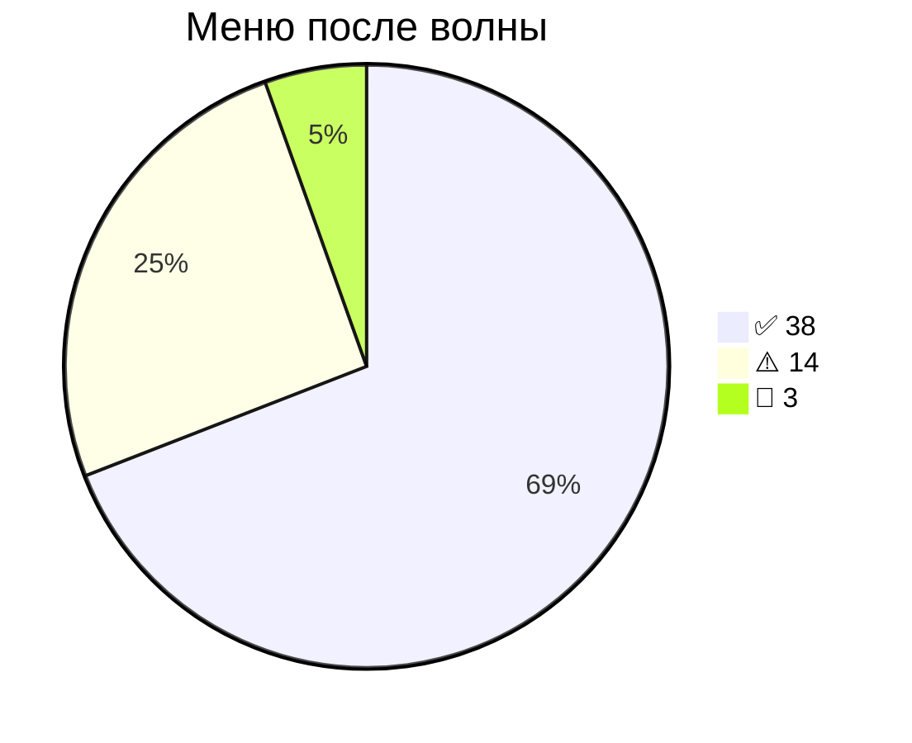
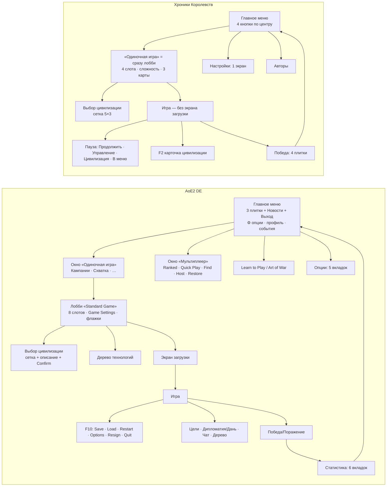
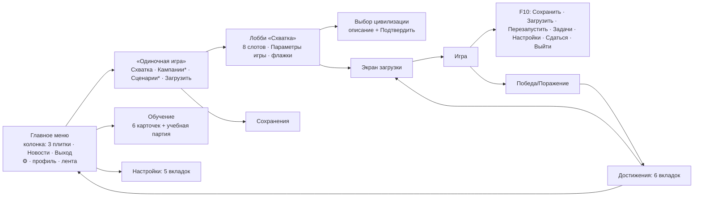

# 02 · Меню и экраны — паритет с AoE2 DE (квантовый аудит)

Квант = один проверяемый факт. **Эталон** — AoE2: Definitive Edition (текущая версия, если не оговорено), **У нас** — код + снимки `shots/research_menus/` (прогон `tools/ui_flow_test.py --out shots/research_menus`).
Вердикт: ✅ совпадает · ⚠️ частично · ❌ нет · 🚫 только имитация (арт/звук/бренд Microsoft). Цена: мелко (≤½ дня) · средне (1–3 дня) · крупно (неделя+).

## Сводка

| | ✅ | ⚠️ | ❌ | 🚫 | всего |
|---|---|---|---|---|---|
| до (аудит) | 6 | 24 | 22 | 3 | 55 |
| **после волны меню** | **38** | **14** | **0** | **3** | **55** |



Осталось ⚠️: режимы игры (M17), список карт (M24), часть флажков (M25–M26), дерево в лобби (M27, M31),
сетка выбора цивилизации (M29), кампании (M09), часть настроек (M47–M48), окна панелей (M36–M39 — см. 03_hud).

### Топ‑10 разрывов (польза для «ощущения DE» ÷ цена)

| # | Разрыв | Квант | Цена |
|---|---|---|---|
| 1 | Нет колонки «Параметры игры» (ресурсы, население, эпохи, раскрытие карты, победа, договор) | M15, M18–M22 | средне |
| 2 | Нет экрана статистики после игры (6 вкладок, счёт) | M42–M44 | средне |
| 3 | Нет F10‑меню с «Сохранить / Загрузить / Заново / Сдаться» | M33–M35 | крупно (сохранения) |
| 4 | Нет дерева технологий (в лобби и в игре) | M31 | крупно |
| 5 | Главное меню: не та раскладка (DE — левая колонка с 3 плитками‑иллюстрациями) | M01–M04 | средне |
| 6 | Нет промежуточного окна «Одиночная игра» (Кампании / Схватка / Загрузка) | M08 | мелко |
| 7 | Лобби: 4 слота вместо 8, нет «–»/«?» у команды, иной порядок цветов | M11–M14 | средне |
| 8 | Сложность ИИ: 3 уровня вместо 6 | M16 | мелко (UI) |
| 9 | Настройки: 1 экран вместо 5 вкладок; нет «Голос», скорости прокрутки, горячих клавиш | M45–M49 | средне |
| 10 | Верхняя панель в игре: нет кнопок Цели / Дипломатия / Чат / Дерево | M36–M38, M40 | средне |

## Схема экранов: DE vs у нас



Было: не хватало трёх узлов DE — окна «Одиночная игра», экрана загрузки и статистики; веток «Сохранить/Загрузить».

### После волны меню


`*` — «скоро».

## Кванты

### 🏠 Главное меню

| ID | Эталон DE | У нас | В | Источник | Цена |
|---|---|---|---|---|---|
| M01 | Колонка слева (~⅓ ширины), фон‑иллюстрация справа | Колонка слева 400 px (31 %), справа — живой город игры | ✅ | [S5] forum_1.jpg; `shots/research_menus/01_menu.png` | средне |
| M02 | Порядок: Single Player · Multiplayer · Learn to Play · ─ · News · Exit | Одиночная игра · Сетевая игра («скоро») · Обучение · ─ · Новости · Выход | ✅ | [S5]; `game/menu.py:17` | мелко |
| M03 | Пункты — плитки‑иллюстрации (эскиз тушью + красная плашка с текстом) | 3 плитки: эскиз сепией из своих спрайтов + красная плашка (`game/menu_art.py`) | ✅ | [S5], [S11] single_player 380×193 | средне (арт своё) |
| M04 | Справа вверху: ⚙ опции, почта, аватар+имя; справа — лента событий/новостей | ⚙ настройки, профиль (герб + имя), громкость; справа — лента новостей (git log) | ✅ | [S5] | мелко (без онлайна) |
| M05 | Строка версии внизу по центру | «Версия 0.9.N · сборка дата» по центру снизу | ✅ | [S5], wiki mainmenu (версия 201.101…) | мелко |
| M06 | Логотип игры вверху колонки | Название «ХРОНИКИ КОРОЛЕВСТВ» + подзаголовок | ✅ | [S5]; 01_menu.png | — |
| M07 | Музыка меню + звук клика | Есть трек «menu», `audio.click()` | ✅ | `game/sound.py:1404`, `menu.py:123` | — |

### 🎯 Окно «Одиночная игра»

| ID | Эталон DE | У нас | В | Источник | Цена |
|---|---|---|---|---|---|
| M08 | Модальное окно с плитками (Кампании, Схватка‑Skirmish ≈404×358 и др.) + Cancel, как у «Мультиплеер» | Окно: Схватка · Кампании · Сценарии · Загрузить игру + Отмена | ✅ | [S4] Multiplayer‑Nov‑2020.jpg, [S11] skirmish.png | мелко |
| M09 | Кампании / Историч. битвы / Art of War / Сценарии | Плитки «Кампании», «Сценарии» есть, помечены «скоро» | ⚠️ | [S1] sg_26, [S3] | крупно |

### ⚔ Лобби «Standard Game» (схватка)

| ID | Эталон DE | У нас | В | Источник | Цена |
|---|---|---|---|---|---|
| M10 | Заголовок экрана «Standard Game» | Плашка «Схватка» | ✅ | [S2] | мелко |
| M11 | 8 строк игроков + поле «Players» (число) | 8 строк + «Игроки: N» (2–8) | ✅ | [S2]; `menu.py:15 MAX_AI=3` | средне |
| M12 | Столбцы: цвет‑номер · Player (выпадающий: имя/AI/Open/Closed) · Civilization · Team | Номер-цвет · Игрок (ИИ · уровень / Закрыто) · Цивилизация (герб) · Команда | ✅ | [S2]; 02_setup.png | мелко |
| M13 | Команда: «–», 1, 2, 3, 4, «?» | «–», 1–4, «?» (случайная, с проверкой ≥2 команд) | ✅ | [S1] sg_31; `menu.py:152` | мелко |
| M14 | 8 цветов в порядке: синий, красный, зелёный, жёлтый, голубой, фиолетовый, **серый, оранжевый** | Порядок DE в лобби: … серый 7-й, оранжевый 8-й | ✅ | [S2]/[S3]; `data.py:37‑39` | мелко |
| M15 | Колонка «Game Settings» справа: Data Mod · Civilization Set · Game Mode · Location · Map Size · AI Difficulty · Resources · Population · Game Speed · Reveal Map · Starting Age · Ending Age · Treaty Length · Victory | Колонка «Параметры игры» справа: местность, режим, размер, сложность ИИ, ресурсы, население, скорость, открытие карты, эпохи, перемирие, победа (Data Mod / Civ Set — нет смысла) | ✅ | [S2] | средне |
| M16 | AI Difficulty — 6 уровней: Easiest, Standard, Moderate, Hard, Hardest, Extreme | 6 уровней в слоте и общий выбор; ИИ: 6 профилей (`ai.LEVELS`), бонус добычи по уровню | ✅ | [S1] sg_52, [S2]; `data.py:43` | мелко (UI) / средне (ИИ) |
| M17 | Game Mode: Random Map, Regicide, Death Match, King of the Hill, Sudden Death, Capture the Relic, Defend the Wonder, Wonder Race, Empire Wars, Battle Royale, Custom Scenario | Случайная карта + Смертельная схватка | ⚠️ | [S1] sg_49 | крупно |
| M18 | Resources: Standard / Low / Medium / High (+Ultra) | Стандарт / Мало / Средне / Много / Очень много (DM — 20000/20000/10000/5000) | ✅ | [S1] sg_37 | мелко |
| M19 | Population: по умолчанию 200, шаг 25 | 25–200, шаг 25; предел в `World.pop_limit` | ✅ | [S1] sg_37 | мелко |
| M20 | Game Speed: Slow · Casual · Normal · Fast (1.0 · 1.5 · 1.7 · 2.0) | В лобби: Медленная 1.0 · Спокойная 1.5 · Нормальная 1.7 · Быстрая 2.0 | ✅ | [S8]; `ui.py:22`, `data.py:16` | мелко |
| M21 | Reveal Map: Normal / Explored / All Visible; Starting Age / Ending Age; Treaty Length (None…) | Открытие: обычное / разведана / всё видно; эпохи начала (до постимперской) и конца; перемирие 5–60 мин — чужие не враги до срока | ✅ | [S1] sg_37 | средне |
| M22 | Victory: Standard (завоевание + реликвии + чудо) / Conquest / Time Limit / Score … | Стандарт = Завоевание (реликвий и чудес нет в игре) · Лимит времени · Очки | ✅ | [S1] sg_37; 11_help.png | средне |
| M23 | Map Size: Tiny (2 player) [120] … Giant; выбирается вручную | Авто или вручную: 96 / 110 / 120 / 136 / 152 | ✅ | [S2]; `data.py:14` | мелко |
| M24 | Location: кнопка → список десятков карт (Arabia, Coastal…) | 3 местности с превью (материк, прибрежье, острова) | ⚠️ | [S2], [S1] sg_37; 02_setup.png | средне |
| M25 | Флажки Team Settings: Lock Teams, Team Together, Team Positions, Shared Exploration, Handicap | Закрепить команды, Команды рядом (без позиций, общей разведки, форы) | ⚠️ | [S2] | мелко |
| M26 | Флажки Advanced: Lock Speed, Allow Cheats, Turbo Mode, Full Tech Tree, Empire Wars / Sudden Death / Regicide / Antiquity Mode, Record Game | Закрепить скорость, Полное дерево (без читов, турбо, режимов) | ⚠️ | [S2] | средне |
| M27 | Кнопки: Return to Main Menu · Technology Tree · Start Game (слева внизу); Randomize · Reset (под настройками) | В главное меню · Начать игру; Случайно · Сбросить (нет кнопки дерева в лобби) | ⚠️ | [S2]; `menu.py:94‑95` | мелко |
| M28 | Справа от слотов пусто; описание цивилизации — только в окне выбора | Карточки справа нет — описание в окне выбора | ✅ | [S2], [S6] | — |

### 🛡 Выбор цивилизации и дерево

| ID | Эталон DE | У нас | В | Источник | Цена |
|---|---|---|---|---|---|
| M29 | Модалка «Select Civilization»: сверху Random · Full Random · Mirror; сетка гербов 9 в ряд | Модалка: «Случайная» первой, сетка 5×3 | ⚠️ | [S6] forum_4.jpg; 03_picker.png | мелко |
| M30 | Правая панель в модалке: тип, бонусы, уник. юнит, техи, командный бонус + портрет; Confirm / Cancel | Справа описание цивилизации; «Подтвердить» / «Отмена» | ✅ | [S6]; `menu.py:498` | мелко |
| M31 | Экран «Дерево технологий» (кнопка в лобби и в игре) | В игре — окно «Древо технологий» (панели); в лобби нет | ⚠️ | [S2], [S3]; 12_civ_card.png | крупно |
| M32 | Гербы цивилизаций (щиты) | Свои гербы‑щиты | 🚫 | [S6] | — |

### ⏸ В игре: меню, цели, дипломатия

| ID | Эталон DE | У нас | В | Источник | Цена |
|---|---|---|---|---|---|
| M33 | F10 → меню игры: Save / Load / Restart / Options / Resign / «Quit Current Game» / назад в игру | F10: Вернуться · Сохранить · Загрузить · Перезапустить · Задачи · Управление · Цивилизация · Настройки · Сдаться · Выйти в меню · Выйти из игры (опасное — с подтверждением) | ✅ | [S11] quit.PNG; `hud.py:52` | средне |
| M34 | Сохранение и загрузка партии (+ «Saves & Replays» в меню) | Слоты с миниатюрой, именем, датой, цивилизацией, временем; F7/F8; автосохранение; «Одиночная игра» → «Загрузить игру» | ✅ | [S1] sg_26, [S9] | крупно |
| M35 | Сдаться (Resign) и Заново (Restart) | Сдаться (`World.resign`), Перезапустить (те же параметры) | ✅ | [S11], [S4] | мелко |
| M36 | Верх справа: Tech Tree · Objectives · Chat · Diplomacy · Options · Menu | «Меню» + громкость; герб → F2 | ⚠️ | [S3] | средне |
| M37 | Objectives: цели + параметры партии (карта, размер, сложность) | Одна строка «Цель: …» внизу окна «Управление» | ⚠️ | [S3]; 11_help.png | мелко |
| M38 | Diplomacy: Ally / Neutral / Enemy по игрокам, Allied Victory, дань | Нет окна; дань — кнопками в рынке | ⚠️ | [S12]; `economy_ui.py:48` | средне |
| M39 | Чат и лог сообщений слева; F11 — время/скорость/FPS | Лог слева ✅, время и ×скорость всегда видны; чата нет | ⚠️ | [S3]; 10_game_menu.png | мелко |
| M40 | F4 — счёт игроков над миникартой | F4 — счёт над мини-картой (формула `game/scoring.py`) | ✅ | [S3] | мелко |
| M41 | Пауза с затемнением | Есть (затемнение + окно «Пауза») | ✅ | 10_game_menu.png | — |

### 🏆 Конец игры и статистика

| ID | Эталон DE | У нас | В | Источник | Цена |
|---|---|---|---|---|---|
| M42 | «Victory!/Defeat!» → экран достижений; кнопки Leave Map · Play Again · Return to Main Menu | Модалка «Победа!/Поражение» → Достижения · Остаться на карте · Главное меню; на листе — «Сыграть снова» | ✅ | [S11]; `hud.py:732`; 13_victory.png | мелко |
| M43 | Вкладки: Score · Military · Economy · Technology · Society · Timeline | Итог · Армия · Экономика · Технологии · Общество · Хронология (график населения, отметки эпох) | ✅ | [S10] Scoresheet.jpg | средне |
| M44 | Счёт = военный + экономика + технологии + общество (формулы 20% / 10%) | `scoring.score(world, pid)`: 20 % убитого/разрушенного, 10 % ресурсов и дани + 20 % живого, 20 % технологий + разведка, 20 % замков | ✅ | [S10] | средне |

### ⚙ Настройки

| ID | Эталон DE | У нас | В | Источник | Цена |
|---|---|---|---|---|---|
| M45 | Вкладки: Game · Graphics · Interface · Audio · Hotkeys | Игра · Графика · Интерфейс · Звук · Горячие клавиши | ✅ | [S9], [S8] | средне |
| M46 | Audio: отдельно Music · Sound · Voice | Музыка · Эффекты · Голоса (3 ползунка) + вкл/выкл | ✅ | [S9]; 15_settings.png | мелко |
| M47 | Game: скорость прокрутки, инерция, подсветка объектов, скорость игры | Скорость новой партии, скорость прокрутки, прокрутка краем, автосохранение (нет инерции и подсветки) | ⚠️ | [S8] | мелко |
| M48 | Interface: масштаб HUD до 125%, цвета игроков / свой‑чужой, режим дальтоника | Буквы клавиш, счёт F4, общая очередь, размер подсказок, курсоры (нет масштаба HUD и дальтонизма) | ⚠️ | [S8] | средне |
| M49 | Hotkeys: переназначение клавиш | 17 действий, захват клавиши, обмен при конфликте, сброс; ввод игры слушается (`keymap`) | ✅ | [S9]; 11_help.png | средне |
| M50 | Быстрое окно громкости в игре | Есть (значок → ползунки) | ✅ | `sound.py:1084` | — |

### ⏳ Загрузка, переходы, прочее

| ID | Эталон DE | У нас | В | Источник | Цена |
|---|---|---|---|---|---|
| M51 | Экран загрузки: арт + игроки/цивилизации + прогресс | Превью карты, игроки с гербами и уровнями, параметры, совет, прогресс по шагам | ✅ | [S14] | мелко |
| M52 | Арт загрузочного экрана и меню (портреты героев) | — | 🚫 | [S14], [S5] | — |
| M53 | «Об игре / Авторы» с прокруткой | Кнопка в главном меню и в настройках | ✅ | `menu.py:709`; 14_credits.png | — |
| M54 | Мультиплеер: Ranked · Quick Play · Find Custom Game · Host Game · Restore Game + Cancel | Нет | 🚫/❌ (онлайн вне рамок) | [S4] | — |
| M55 | Esc = назад / выход из меню | Есть | ✅ | `menu.py:218‑226` | — |

> Подсчёт (до): ✅ M06 M07 M41 M50 M53 M55 · 🚫 M32 M52 M54 · M28 — у нас лишний элемент (учтён как ⚠️).
> Подсчёт (после): ⚠️ M09 M17 M24 M25 M26 M27 M29 M31 M36 M37 M38 M39 M47 M48 · 🚫 M32 M52 M54 · остальные 38 — ✅.
> M36–M39 (кнопки и окна верхней панели) — зона панелей, вердикт не пересматривался здесь.

## Раскладка лобби DE (по снимку 1920×1080, [S2])

```
┌───────────── "Standard Game" (заголовок‑плашка по центру) ─────────────┐
│ ┌── Player ──────────── Civilization ─ Team ┐ ┌── Game Settings ──────┐│
│ │[1]▼имя           [герб Athenians]   [-]   │ │ Data Mod   ▼          ││
│ │[2]▼AI            [герб Byzantines]  [-]   │ │ Civ Set  ◉All ○II ○Chr││
│ │   ▼Closed  × 6                            │ │ Game Mode  ▼ Location ││
│ │Players ▼2                                 │ │ … 14 строк …          ││
│ └───────────────────────────────────────────┘ │ Team ☑4   Advanced ☑9 ││
│ [Return to Main Menu] [Technology Tree] [Start]│ [Randomize] [Reset]  ││
└────────────────────────────────────────────────┴──────────────────────┘
```
Доли: слоты ≈ 47% ширины (x 13–61%), настройки ≈ 25% (x 61–86%). У нас: слоты 56% (x 3–59%), карточка 36%.

## Источники

- [S1] Steam‑гайд «Beginner's Guide to Multiplayer» (снимки DE 2020: главное меню, лобби, настройки, режимы) — https://steamcommunity.com/sharedfiles/filedetails/?id=2096266627 (локально `shots/ref/menus/sg_26/31/36/37/49/52.png`)
- [S2] Fandom, файл «2DE lobby civilization sets.png» (лобби DE 2024–25) — https://ageofempires.fandom.com/wiki/File:2DE_lobby_civilization_sets.png
- [S3] Fandom «User interface», раздел AoE2 DE — https://ageofempires.fandom.com/wiki/User_interface
- [S4] Официальные заметки Update 42848 (новое главное меню, окно «Multiplayer», Quick Play) — https://www.ageofempires.com/news/aoe2de-update-42848/
- [S5] Форум AoE, «Let's discuss the new main menu» (снимок нового меню) — https://forums.ageofempires.com/t/lets-discuss-the-new-main-menu/105743
- [S6] Форум AoE, «New Main Menu and User Interface» (окно выбора цивилизации) — https://forums.ageofempires.com/t/new-main-menu-and-user-interface/108580 ; «Old Main Menu is back» — https://forums.ageofempires.com/t/old-main-menu-is-back/231395
- [S7] Fandom, «Multiplayer lobby aoe2de.png» (браузер лобби) — https://ageofempires.fandom.com/wiki/File:Multiplayer_lobby_aoe2de.png
- [S8] Официальная страница доступности AoE II DE (вкладки Interface/Game/Audio, скорости игры) — https://www.ageofempires.com/age-ii-de-accessibility/
- [S9] PCGamingWiki AoE II DE (вкладки Graphics/Interface/Game/Audio, Music/Sound/Voice, переназначение клавиш, сохранения) — https://www.pcgamingwiki.com/wiki/Age_of_Empires_II:_Definitive_Edition
- [S10] Fandom «Score» + Scoresheet.jpg (вкладки статистики, формулы) — https://ageofempires.fandom.com/wiki/Score
- [S11] GitHub mboop127/AutoDE — вырезки реальных кнопок DE: «Quit Current Game», «Leave Map», «Play Again», «Return to Main Menu», плитки «Single Player», «Skirmish» — https://github.com/mboop127/AutoDE/tree/main/Images
- [S12] Fandom «Diplomacy» — https://ageofempires.fandom.com/wiki/Diplomacy
- [S14] Fandom «AoE2DE loading slash.png» (арт загрузки) — https://ageofempires.fandom.com/wiki/File:AoE2DE_loading_slash.png

Не удалось проверить напрямую (закрыто Cloudflare / нет снимка): точный набор плиток окна «Одиночная игра» после 2020 г. (подтверждены «Skirmish» и «Campaigns»), полный порядок пунктов F10 (подтверждён «Quit Current Game»), вкладки статистики именно в DE (снимок — оригинал 1999 г.; в DE структура та же по [S10]).
