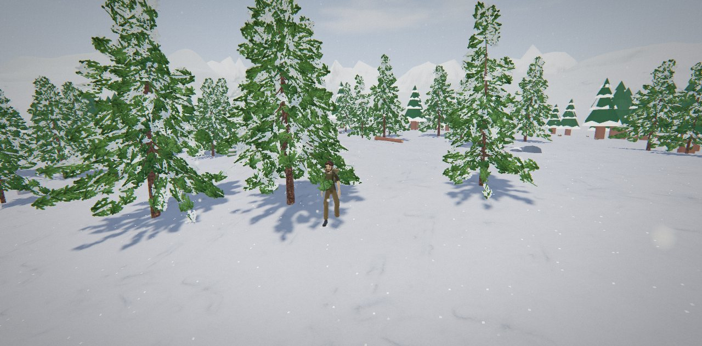
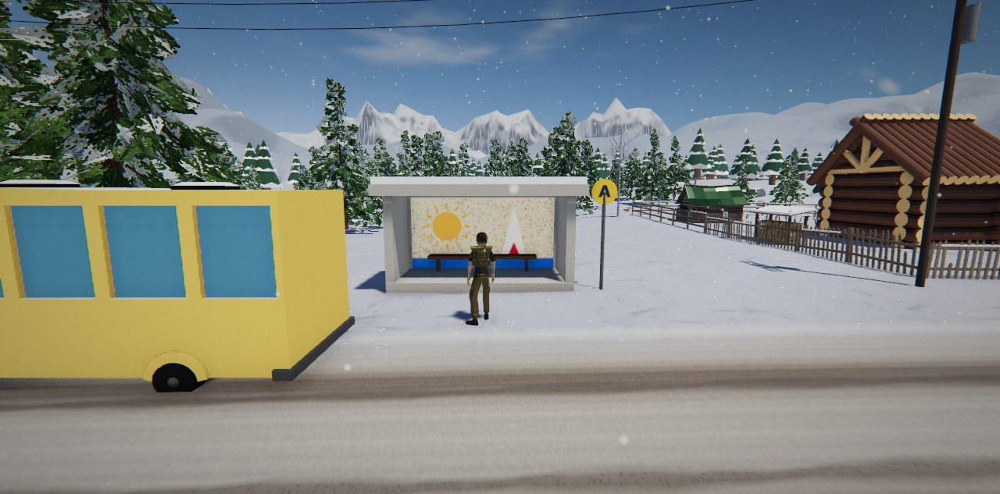
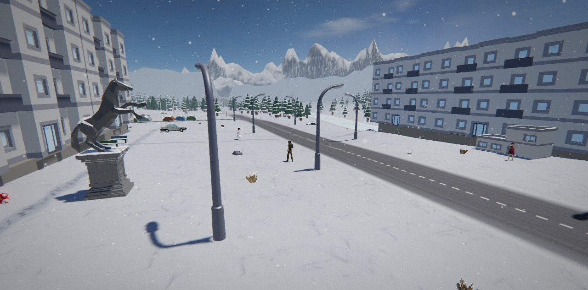

<div align="center">

🇬🇧 **English** · [🇷🇺 Русский](README.ru.md)

# Berezovka

**A snowbound Russian village you can walk into — an open-world 3D game that runs right in your browser. No install, no download.**

[](https://esurvanov.github.io/awesome-games/berezovka/)

[](https://threejs.org/)
[](#-requirements)
[](LICENSE)
[](CREDITS.md)
[](#-run-it-yourself)


</div>

You step off the old bus into Berezovka after five years away. Grandma needs firewood, grandpa's 1979 Zhiguli won't start, the church bell has lost its rope and the shopkeeper's cat is missing somewhere in the woods — past the bear. By evening the whole village gathers for the holiday: ring the bell, and the sky answers with fireworks and the aurora.

## ✨ Features

| | | |
|---|---|---|
| 🗺 **Open world, ~1 km²** — village, Soviet settlement, church on a hill, frozen river, deep forest | 📖 **Story in 12 steps** — five characters, typed dialogue with choices, a finale | 🚗 **Drive the Zhiguli** — 1 t car, 0–100 km/h in 18 s, springs, body roll, drifting on ice |
| 🏡 **14 lived-in yards** — paths trodden in snow, woodpiles, sheds, vegetable plots, benches | 🐻 **Wildlife** — a bear that charges, a husky, a runaway cat, a herd of deer that bolts | 🎣 **Ice fishing** — perch, pike, ruffe, burbot; time the strike |
| 🌗 **Day and night** — sky, light and fog from real HDR panoramas; northern lights after dark | 🌨 **Weather** — blizzards roll in, fog thickens, wind rises | 🪆 **12 hidden matryoshkas** — across the whole map |
| 🚶 **Grounded movement** — real walking speeds, turning arcs, feet that don't slide | 🔊 **Recorded sound** — snow footsteps, a real church bell, a 1927 accordion «Korobushka» on the car radio | 🧭 **Compass, minimap, big map**, save/continue |

## 📸 Screenshots

| Village street | Grandma's yard |
|---|---|
|  |  |
| **The church on the hill** | **Into the forest** |
|  |  |
| **Bus stop at the crossroads** | **The Soviet settlement** |
|  |  |

## 🎮 Controls

| Keys | Action |
|---|---|
| `W A S D` + mouse | walk, look (click to capture the mouse) |
| `Shift` · `C` | run · toggle walk/run |
| `Space` | jump · handbrake in the car |
| `E` | talk, pick up, fish, ring the bell |
| `F` | get in / out of the car |
| `R` · `M` · `H` | car radio · big map · controls |

Touch screens get an on-screen joystick and buttons.

## 🚀 Run it yourself

It is plain static files — no build step.

```bash
git clone https://github.com/Hedgehogues/awesome-games.git
cd awesome-games/berezovka
python3 -m http.server 8000     # any static server works
# open http://localhost:8000
```

Opening `index.html` straight from disk won't work: browsers block module scripts on `file://`.

## 💻 Requirements

A desktop browser with WebGL 2 (Chrome, Edge, Firefox, Safari 16+). About 33 MB loads on first start. A discrete or recent integrated GPU is recommended; on weaker machines the corner shading switches itself off.

## 🛠 How it's made

- **Engine:** three.js r158 as ES modules from a CDN, one page plus five modules in [`src/`](src/): sound, motion, layout, scale, look.
- **Models** are packed as base64 GLB inside `.js` files ([`assets/pack/`](assets/pack/)), so they load from any static host.
- **One source of light:** sky, ambient light and fog all come from the same HDR panoramas, so every model sits in the same light.
- **Every measurable property has a check.** 108 in-game gates print `GATE … OK|FAIL` to the console: building sizes against real ones, walking speed, foot slip, car 0–100, frame brightness and contrast, road contact, repetition, triangle budget.

## 📜 Credits

Code under the [MIT licence](LICENSE). Models, textures, panoramas and sounds come from Quaternius, Poly Haven, Kenney, EZ-Tree, Poly by Google, Wikimedia Commons and others under CC0, CC-BY and MIT. The full list is in [CREDITS.md](CREDITS.md) and in the in-game «Авторы» window.
