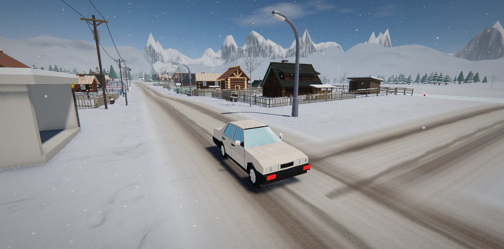
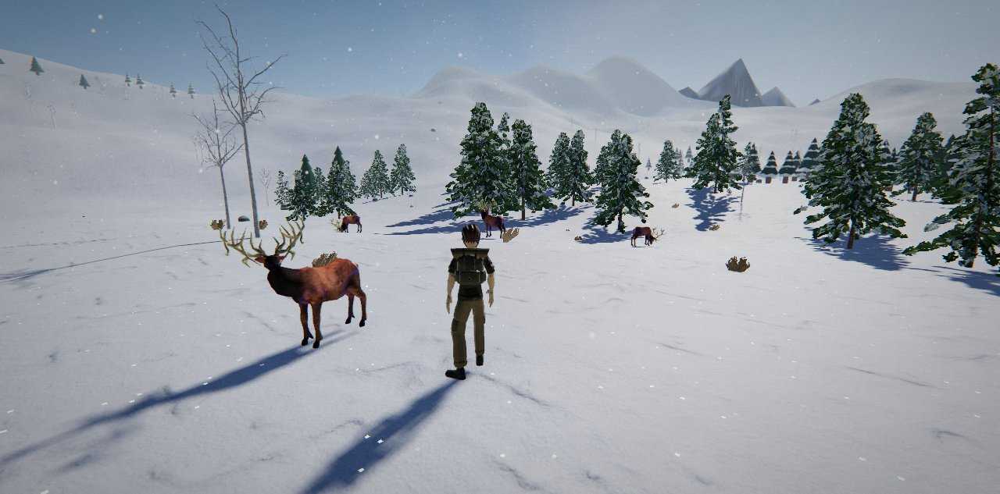

<div align="center">

[🇬🇧 English](README.md) · 🇷🇺 **Русский**

# Берёзовка

**Заснеженная русская деревня, в которую можно войти: 3D-игра с открытым миром прямо в браузере. Ничего не нужно устанавливать.**

[](https://esurvanov.github.io/awesome-games/berezovka/)

[](https://threejs.org/)
[](#-что-нужно)
[](LICENSE)
[](CREDITS.md)
[](#-запустить-у-себя)


</div>

Ваня выходит из старого ПАЗика в Берёзовке, где не был пять лет. У бабушки нет дров, дедова «копейка» семьдесят девятого года не заводится, у колокола перетёрлась верёвка, а кот продавщицы пропал где-то в лесу — за медвежьим углом. К вечеру деревня собирается на праздник: ударишь в колокол — и небо ответит салютом и северным сиянием.

## ✨ Что внутри

| | | |
|---|---|---|
| 🗺 **Открытый мир, около 1 км²** — деревня, посёлок с хрущёвками, храм на холме, замёрзшая река, глухой лес | 📖 **Сюжет из 12 шагов** — пять героев, диалоги с выбором, финал | 🚗 **«Копейка» на ходу** — тонна веса, до сотни за 18 с, подвеска, крен, занос на льду |
| 🏡 **14 жилых дворов** — тропинки в снегу, дровницы, сараи, огороды, лавочки | 🐻 **Звери** — медведь бросается рывками, хаски, пропавший кот, олени убегают | 🎣 **Подлёдная рыбалка** — окунь, щука, ёрш, налим; подсекай вовремя |
| 🌗 **День и ночь** — небо, свет и туман из настоящих фотопанорам, ночью северное сияние | 🌨 **Погода** — налетает метель, густеет туман, поднимается ветер | 🪆 **12 спрятанных матрёшек** по всей карте |
| 🚶 **Живое движение** — реальные скорости шага, повороты дугой, ступни не скользят | 🔊 **Записанный звук** — хруст снега, настоящий церковный колокол, «Коробушка» 1927 года по радио в машине | 🧭 **Компас, мини-карта, большая карта**, сохранение |

## 📸 Кадры

| Деревенская улица | Двор бабушки |
|---|---|
|  |  |
| **Деревенский храм** | **Ели на опушке у деревни** |
|  |  |
| **Остановка на перекрёстке** | **Посёлок** |
|  |  |
| **Дедовы «Жигули» на деревенской дороге** | **Стадо оленей** |
|  |  |

## 🎮 Управление

| Клавиши | Действие |
|---|---|
| `W A S D` + мышь | идти, смотреть (клик — захват мыши) |
| `Shift` · `C` | бег · шаг/бег |
| `Space` | прыжок · ручник в машине |
| `E` | говорить, подбирать, рыбачить, звонить |
| `F` | сесть в машину / выйти |
| `R` · `M` · `H` | радио · карта · подсказки |

На сенсорных экранах — джойстик и кнопки.

## 🚀 Запустить у себя

Это обычные статические файлы, сборка не нужна.

```bash
git clone https://github.com/Hedgehogues/awesome-games.git
cd awesome-games/berezovka
python3 -m http.server 8000     # подойдёт любой статический сервер
# открыть http://localhost:8000
```

Двойной клик по `index.html` не сработает: браузеры не запускают модули с `file://`.

## 💻 Что нужно

Браузер на компьютере с WebGL 2 (Chrome, Edge, Firefox, Safari 16+). При первом запуске загружается около 33 МБ. Желательна отдельная или свежая встроенная видеокарта; на слабых машинах затенение в углах отключается само.

## 🛠 Как сделано

- **Движок:** three.js r158 модулями с CDN — одна страница и пять модулей в [`src/`](src/): звук, движение, расстановка, масштаб, свет.
- **Модели** упакованы в `.js` ([`assets/pack/`](assets/pack/)), поэтому грузятся с любого статического хостинга.
- **Один источник света:** небо, рассеянный свет и туман берутся из одних и тех же фотопанорам — все модели стоят в одном свете.
- **У каждого измеримого свойства есть проверка:** 108 «ворот» пишут в консоль `GATE … OK|FAIL` — размеры построек против реальных, скорость шага, скольжение стопы, разгон машины, яркость и контраст кадра, касание дороги, повторы, бюджет треугольников.

## 📜 Авторы

Код — под [лицензией MIT](LICENSE). Модели, текстуры, панорамы и звуки — Quaternius, Poly Haven, Kenney, EZ-Tree, Poly by Google, Wikimedia Commons и другие, под CC0, CC-BY и MIT. Полный список — в [CREDITS.md](CREDITS.md) и в окне «Авторы» в игре.
