<div align="center">

🇬🇧 **English** · [🇷🇺 Русский](README.ru.md)

# Lars

**September 2022, the queue at the Verkhny Lars border crossing. Live through it in the first person, right in your browser. No install, no build, no libraries.**

[](https://www.urvanov.com/lars/)

[](#-under-the-hood)
[](#-under-the-hood)
[](#-run-it-yourself)
[](LICENSE)


</div>

21–30 September 2022. You are Artyom, 27, a programmer, alone in a car on the road from Moscow to Tbilisi. Ahead of you is 25 km of queue up the Darial gorge. The game has no politics and no villains. There is the queue, the people in it, and ten days to get through.

## ✨ Features

| | | |
|---|---|---|
| 🚗 **A living queue** — 25 km, ~4,000 cars, ~12,000 people, moving by the real day-by-day numbers | 🥪 **Needs** — food, water, warmth, sleep, nerves, phone charge | 💸 **₽ · $ · ₾** — cash or card, exchange rates, prices climbing by the hour as they did |
| 📣 **Rumours** — spread car to car; some turn out true | 📱 **A phone** — queue chats, volunteers, messages from home; no signal in places | 👥 **Named people** — each with good and bad sides; trust counts as currency |
| 🃏 **Event cards** — choices with consequences you can see | 🧾 **End summary** — «What you gave / What you got» | 🔊 **Optional AI voices** — every character sounds different; talk to anyone by voice or text |
| 🏔 **The Darial gorge** — the Terek, cliffs, Chmi, Balta, Nizhny Lars, the checkpoint | 🌗 **Real sky** — each day's sunrise and sunset, moonless nights with a red ribbon of tail lights, rain and wet snow | 🗺 **Map mode** — the whole queue from above (`M`) |
| 🎧 **Synthesised sound** — wind, the river, engines | 📱 **Phone-ready** — touch controls, adaptive quality | 📦 **Nothing to install** — double-click `index.html` |

## 📸 Screenshots

| Day at Chmi | The night ribbon |
|---|---|
| 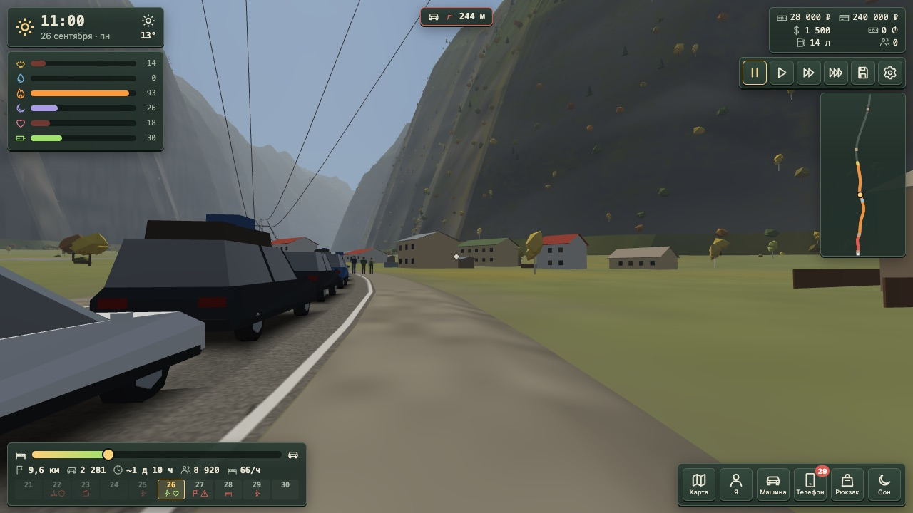 | 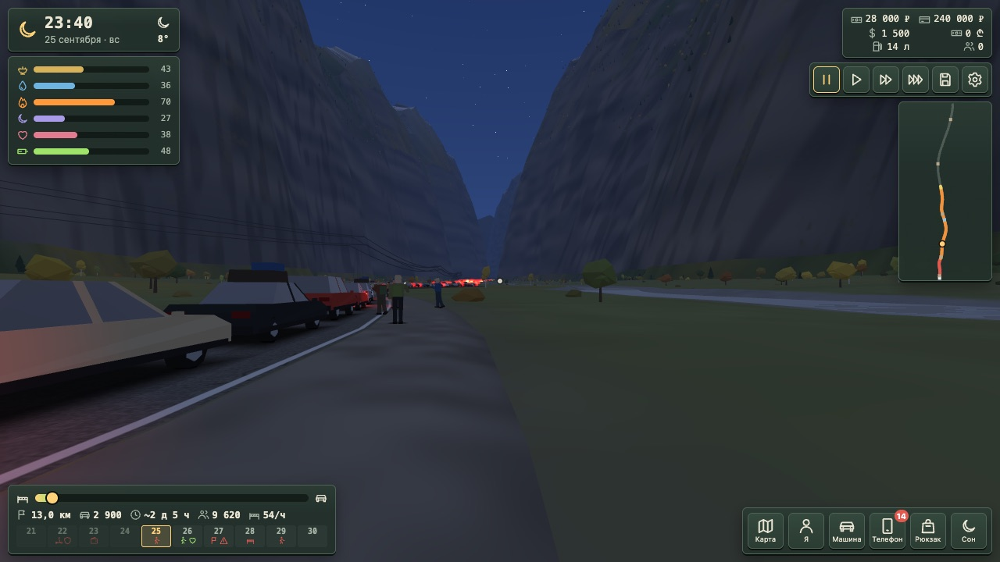 |
| **Morning at Balta** | **Rain at Nizhny Lars** |
| 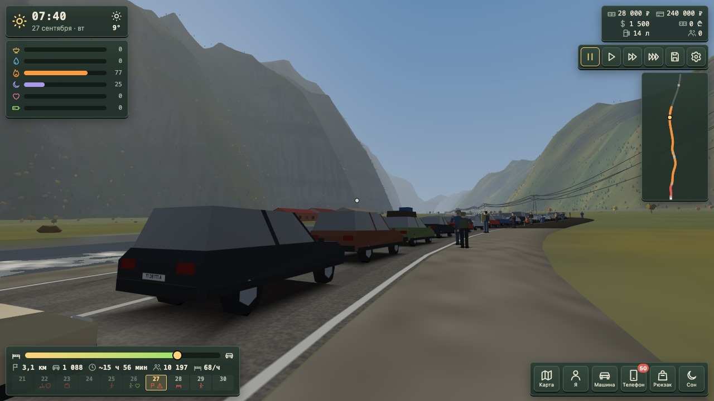 | 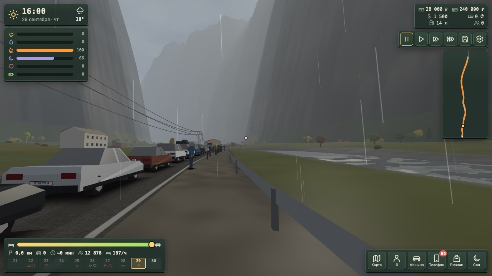 |
| **A seller** | **The phone** |
| 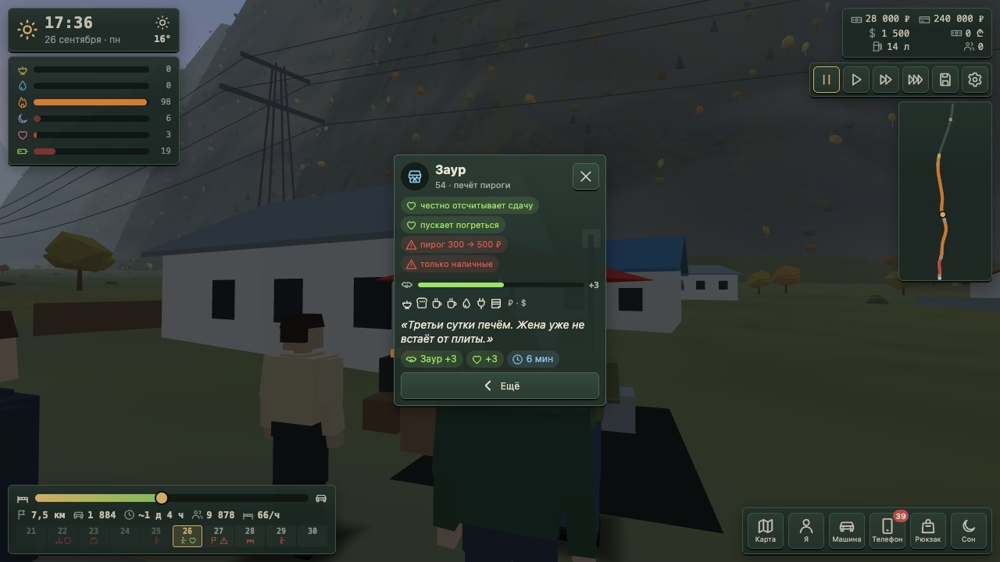 | 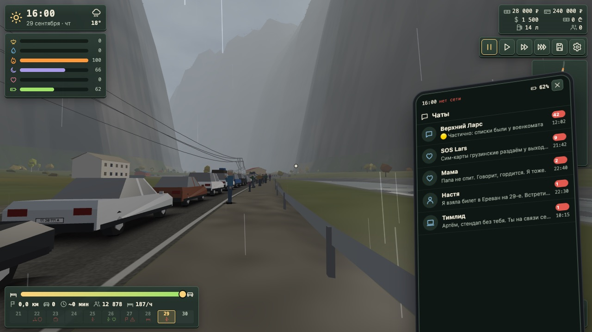 |
| **From the driver's seat** | **The checkpoint** |
| 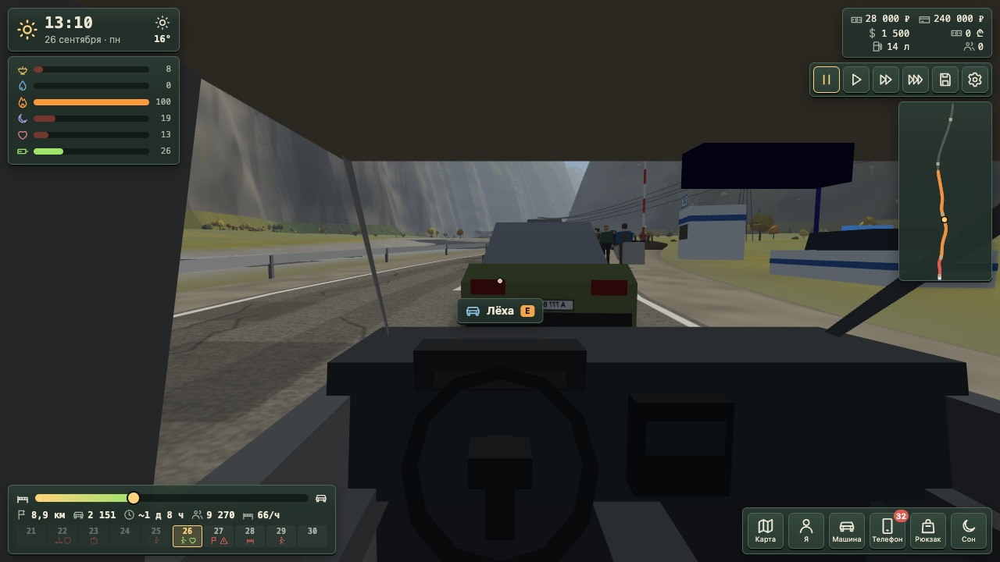 | 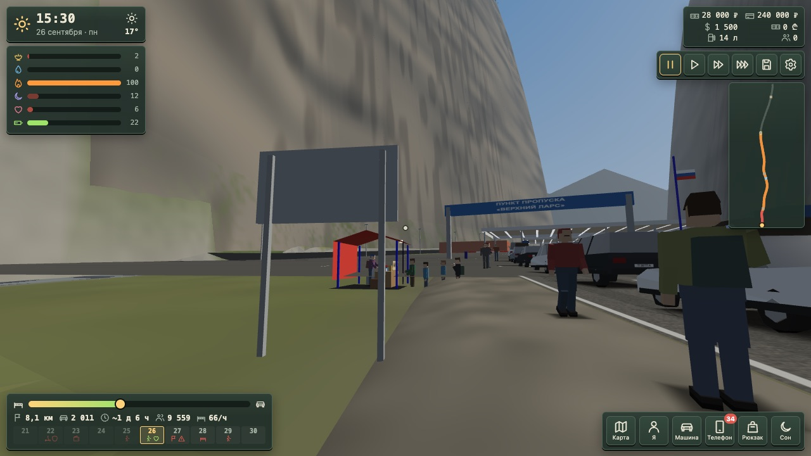 |

| Map mode | On a phone |
|---|---|
| 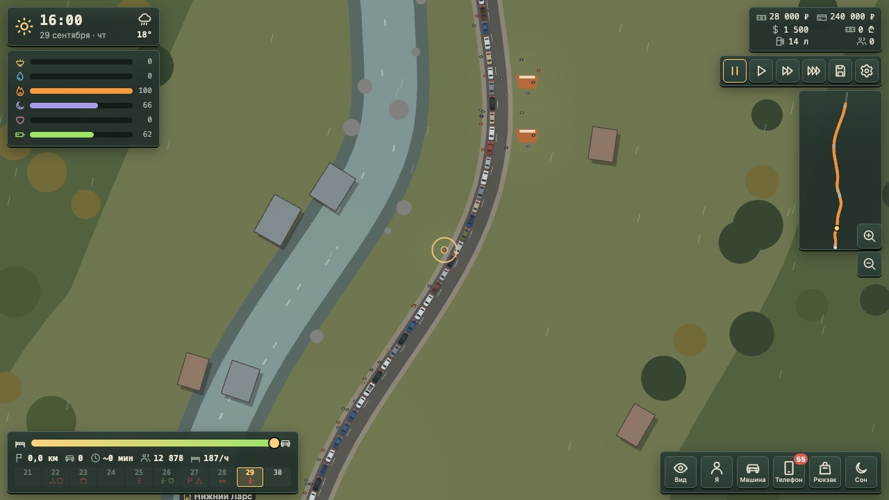 | 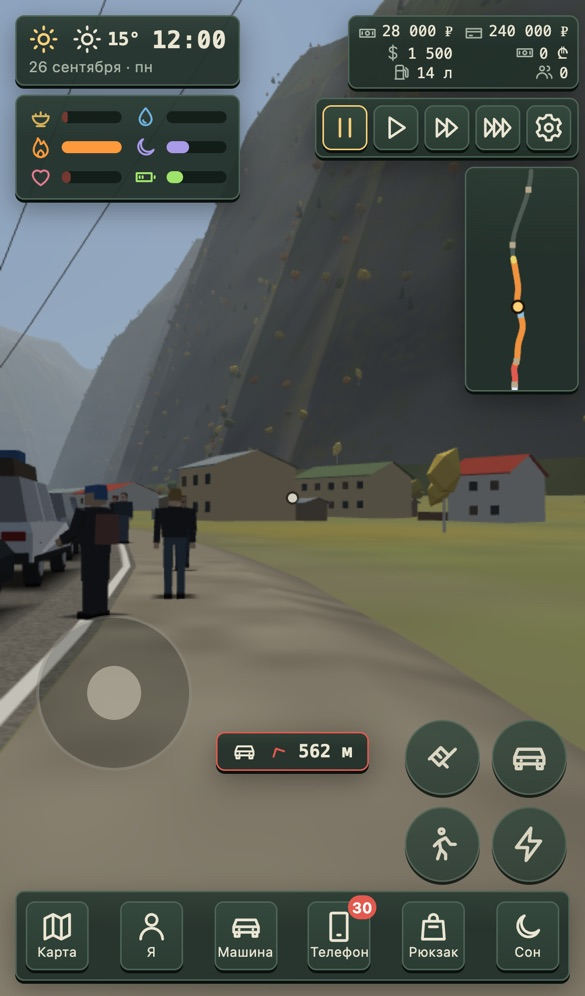 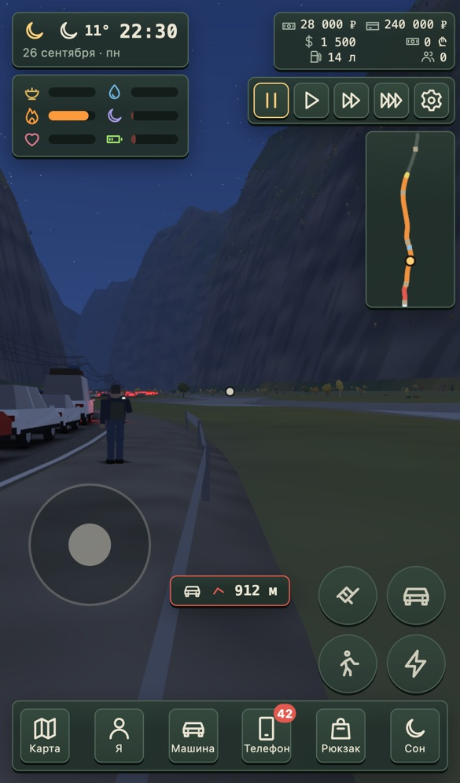 |

## 🎮 Controls

| | Keyboard and mouse | Phone |
|---|---|---|
| Look around | click, then mouse (`Esc` releases) | drag on the right |
| Walk · run | `W` `A` `S` `D` · `Shift` | left stick · 🚶 button |
| Act on who you're looking at | `E` | tap · ✋ button |
| Get out of / into your car | `F` | 🚗 button |
| Torch · sleep · sound | `L` · `Z` · `N` | ⚡ button · «Сон» |
| Say your own words 🎙 | hold `V` | hold 🎙 |
| Map ⇄ first person | `M` | «Карта» |
| Pause · speed ×1 ×4 ×16 | `Space` · `1`–`4` | top buttons |
| Phone · backpack · to your car | `P` · `B` · `C` | bottom buttons |
| Map: pan · zoom | drag · wheel, `+` `−` | drag · pinch |
| Close · stop the voice | `Esc` | ✕ |

At ×1 one game hour takes about a real minute.

## 🔊 Voices (optional)

Off by default: without a key the game is fully text.

| | |
|---|---|
| 🔑 **Turn on** | key from [platform.openai.com/api-keys](https://platform.openai.com/api-keys) → paste on the start card, or ⚙ → «Голос + текст» → «Проверить» |
| 🗣 **Voices** | each named person has their own voice; the unnamed crowd gets a stable voice, mood and accent; ⚙ → «Голоса» to listen |
| 🎙 **Talk** | hold `V` looking at anyone, or type. Their answer depends on the world: prices, rumours, the day, your money, past talks. It can change trust, prices and help, always after your «yes» |
| 💰 **Cost** | paid by OpenAI per use; every voiced line is paid once and cached in the browser; a conversation turn ≈ 1–2k tokens + a few seconds of speech |
| 🔒 **Privacy** | the key stays in this browser only (localStorage); requests go straight to OpenAI; the save keeps only the text of recent lines; «Удалить ключ» in ⚙ |

The microphone needs https, localhost or `file://` in Chromium browsers; elsewhere the 🎙 button hides and typing still works.

## 🛠 Run it yourself

Double-click `index.html`. No server, no build, no libraries.

Any static server works too:

```bash
cd lars/tests && npm install      # once, for the tests
node serve.js                     # http://127.0.0.1:8080/
```

Tests (Node + Playwright):

| | |
|---|---|
| `node sim-queue.js` | the queue day by day against the research numbers, wait time, step speed |
| `node invariants.js` | engine invariants: driving gates the car (no jumping/ending the game without a driver), walking costs time proportional to the game clock (not frame rate or pause), save/load rebuilds sellers and the queue lane exactly |
| `node reachability.js` | "role window" test: plays the single role across many seeds × choice policies, records its real (km, day, hour) trajectory and everything that actually fired, then checks every event/phone message/rumour/calendar rule's declared `when` window against that trajectory — fails on rules never entered, rumour reveals never seen after being learned, or events whose window never overlaps the role's reach at all; writes `reachability-report.{json,md}` |
| `node smoke.js` | no errors over a server and `file://`; walking, menus, car, map, shop, phone, save; voices and talk with a fake OpenAI |
| `node perf.js` | slowed CPU: laptop and phone, first person, in the car, at night, map |
| `node shots.js` | screenshots as PNG into `docs/screenshots/` (`ANGLE=swiftshader` for a software GPU) |

The README images are JPG copies: `sips -s format jpeg -s formatOptions 82 in.png --out out.jpg`.

## 🧱 Under the hood

Plain `<script>` files registered in one `L` registry (ES modules don't load from `file://`), one frame loop, fixed-step simulation with a seed, simulation kept apart from drawing. The engine knows no stories: all content lives in data.

| Folder | What it does |
|---|---|
| `js/core.js` | seeded RNG, event bus, clock and calendar, fixed step, saves |
| `js/sim/` | road, queue, needs and weather, economy, rumours, event director, condition and effect language |
| `js/render/` | WebGL: gorge terrain from the route profile, cars, people, villages, checkpoint, lights, sky; first-person player; top-down map in Canvas 2D; synthesised sound; adaptive quality |
| `js/ui/` | own icons, HUD, action menu, event cards, phone, backpack and shop, end summary, settings, talk window |
| `js/audio/` · `js/ai/` | OpenAI voice with cache; live conversation: prompt from the world state, whitelist of consequences |
| `js/content/` | **data**: calendar, route, goods, people, role, rumours, events, actions, phone, voices — the schema is in each file's header |

## 📚 Research

The numbers in the game come from four research notes in [docs/research](docs/research/), about 90 linked sources.

| | |
|---|---|
| 🗓 [Timeline](docs/research/timeline.md) | day by day: queue size, checkpoint rules, what changed and when |
| 💸 [Economy](docs/research/economy.md) | prices of food, water, bikes and scooters, rides and places in the queue; exchange rates by date; who earned |
| 🏔 [Geography](docs/research/geography.md) | the route km by km, checkpoint plans, elevations, weather and daylight for each day |
| 👥 [People](docs/research/people.md) | 46 personal stories, sensory details, rumours from the chats |

Personal accounts are anonymised: names removed, only age, job and situation kept. Named characters in the game are composites with invented names. The raw analyses of public queue chats contain verbatim quotes of real people and are kept private.

## 🤍 About the subject

Tens of thousands of people stood in this queue, and each one has their own story. The game tells none of them directly. It has no villains and takes no sides: people, facts and feelings in it always have both a good and a bad side. If you were there, we hope it feels true.

## 📜 Licence

Code — MIT, see [LICENSE](LICENSE). Everything you see and hear is drawn and synthesised in code; data sources are listed in [CREDITS.md](CREDITS.md).
