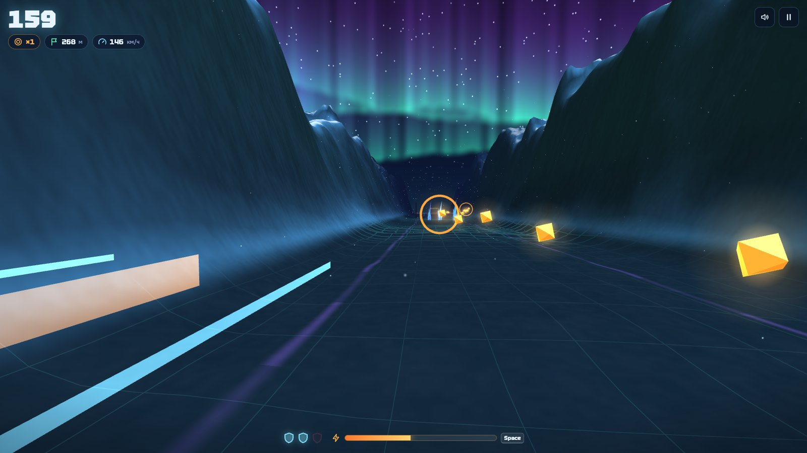

🇬🇧 **English** · [🇷🇺 Русский](README.ru.md)

# Northern Rift

**Fly a small ship down an endless ice canyon under the northern lights — a one-file 3D arcade that runs right in your browser.**

The canyon never ends. Collect crystal shards, turn them into energy, then burst through the ice walls. Fly around, over and under the obstacles, keep the combo alive and see how far you get before three hits bring you down.

## ✨ Features

| | | |
|---|---|---|
| ♾ **Endless canyon** — generated as you fly, never the same twice | 💎 **Shards → energy → break the ice** — boost straight through walls | ✖️ **Combo ×2 … ×8** — for weaving around, over and under |
| 🛡 **3 hits** — then the run is over | 🌌 **Aurora, stars, glowing crystals** — everything drawn in code, no image files | 📱 **Touch controls** — a boost button appears on phones |

## 🎮 Controls

| | |
|---|---|
| `W A S D` / arrows | steer |
| `Space` / `Shift` | boost through ice |
| `Enter` | start |

## 🚀 Run it yourself

Open **[esurvanov.github.io/awesome-games/severny-razlom](https://esurvanov.github.io/awesome-games/severny-razlom/)** — or double-click `index.html`. It is one file: three.js and the fonts come from a CDN.

It is the first game made in the world of [Echo of the Rift](../ekho-razloma/) — the same island, seen from the air.

## 📸 More

## 📜 Licence

Code — MIT ([LICENSE](LICENSE)). Fonts and libraries — see [CREDITS.md](CREDITS.md).
