# Архитектура игры «Северный Разлом»: C4 и критические пути

Игра «Северный Разлом» — 3D-аркада про полёт по бесконечному ледяному каньону: один файл `index.html` около 70 КБ, без сборки и без своих ассетов. Здесь описано, как она устроена: схемы C4 до уровня компонентов и четыре пути, на которых всё держится.

## C4: контекст и контейнеры

### Уровень 1. Система и её окружение

### Уровень 2. Контейнеры

## C4 уровня 3: компоненты контекстов

Скрипт делится на два контекста. Правила игры хранят состояние и решают, что произошло; сцена и звук только показывают результат. Общий язык один: объект состояния `G` и корабль `ship`.

### Правила игры

`: она же двигает корабль, зовёт генератор и проверяет столкновения.")

- Восемь шаблонов препятствий (кристаллы, лазеры, кольца, слалом, маятник и другие) выбираются случайно с весами.
- Сложность растёт плавно: `diff()` от 0 до 1 на дистанции 14 000 м, новые шаблоны открываются по порогам.
- Три щита; после удара 1,7 с неуязвимости. Прорыв ломает лёд и стоит энергии.
- Счёт = бонусы × множитель + половина дистанции. Множитель ×1…×8 растёт за кольца и сбрасывается ударом.

### Сцена и звук

- Снег, полосы скорости и препятствия пересаживаются вперёд, когда уходят за камеру: объекты не копятся.
- Все частицы лежат в одном буфере на 1400 точек; звук — генератор на Web Audio, который шагает по тактам заранее.
- Цвет сияния плавно меняется каждые 2500 м (новый сектор).

## Четыре критических пути

### 1. Запуск

### 2. Один кадр

### 3. Ввод в действие

### 4. Удар и конец заезда

## Правила, на которых всё держится

- **Один цикл, одно состояние.** Режим (`state`) и счёт (`G`) меняет только код скрипта; экраны лишь показывают.
- **Мир идёт за кораблём.** Корабль движется по оси z, а каньон, небо и снег подстраиваются под камеру.
- **Объекты не копятся.** Что ушло за корабль на 30 м, убирается; впереди держится запас в 430 м.
- **Кадр защищён.** Время кадра ограничено, пауза обнуляет его, потеря фокуса ставит игру на паузу.
- **Сохранения безопасны.** Любая ошибка localStorage гасится, игра работает и без него.

## Слабые места

| Где | Что не так |
|---|---|
| **Монолит** | Звук, мир, правила и интерфейс лежат в одном блоке; границы только в комментариях. |
| **Одна функция кадра** | `update` растёт: ввод, спавн, столкновения и камера в одном месте. |
| **Внешние зависимости** | three.js и шрифты с CDN: без сети игра не стартует. |
| **Нет тестов** | Правила счёта и сложности проверяются только игрой. |
| **Случайность** | Каньон строится от `Math.random` без зерна: заезд не воспроизвести. |
