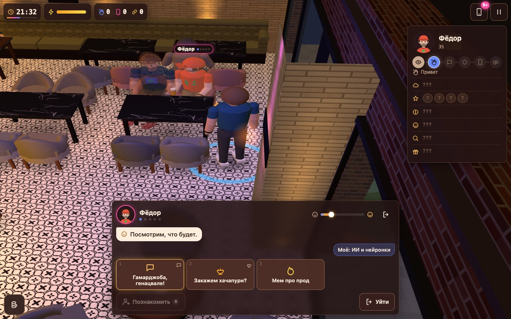

# Skhodka

🇬🇧 **English** · [🇷🇺 Русский](README.ru.md) · **[▶ Play](https://www.urvanov.com/skhodka/)**

A Saturday evening at the SushiGO bar in Batumi, 19:00 → 01:00, about 18 minutes. You are a member of the local IT chat: meet people, make friends and introduce people who need each other. Everyone in the bar is a composite character with an invented name. The game is in Russian.




## Run

Double-click `index.html`. No server, build step or install needed (three.js is bundled). `?seed=42` in the address replays the same evening.

## Controls

| | Mouse | Touch |
|---|---|---|
| 👋 walk up and talk | click a person or their name tag | tap |
| 🚶 walk · 🪑 sit | click the floor · click a seat | tap |
| 💬 reply | a card in the panel, `1`–`4` | tap |
| 🔗 introduce two people | «Познакомить» → a friend | tap |
| 🍺 order · 📸 group photo | buttons bottom left | tap |
| 📱 phone | button, `P` | tap |
| 🎥 camera | drag — pan, right button / Shift — rotate, wheel — zoom | drag, pinch |
| ⏸ pause, quality, sound | `Esc` | button |

## Inside

Plain `<script>` files with a tiny registry (`js/l.js`, list in `js/manifest.js`): `js/content/` — data (bar layout, roles, temperaments, moods, oddballs, topics, cards, lines, events, chat, tuning); `js/sim/` — the evening without DOM or WebGL (navigation, crowd, behaviour, conversations, events, score); `js/render/` — three.js hall, lighting, camera, people; `js/ui/` — HUD, conversation, phone, screens. Design notes: `docs/scenario.md`, `docs/plan.md`.

## Tests

```sh
cd tests && npm install
node content.js && node sim.js && node balance.js && node smoke.js && node perf.js
```
