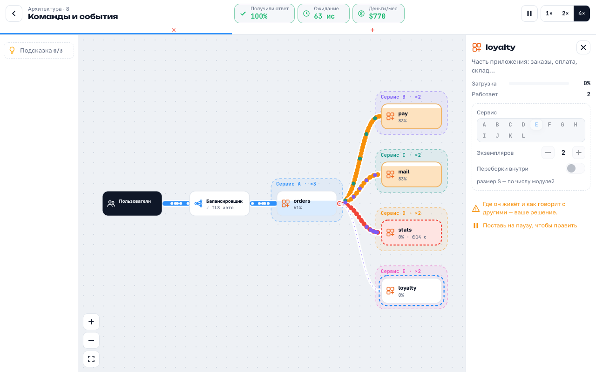
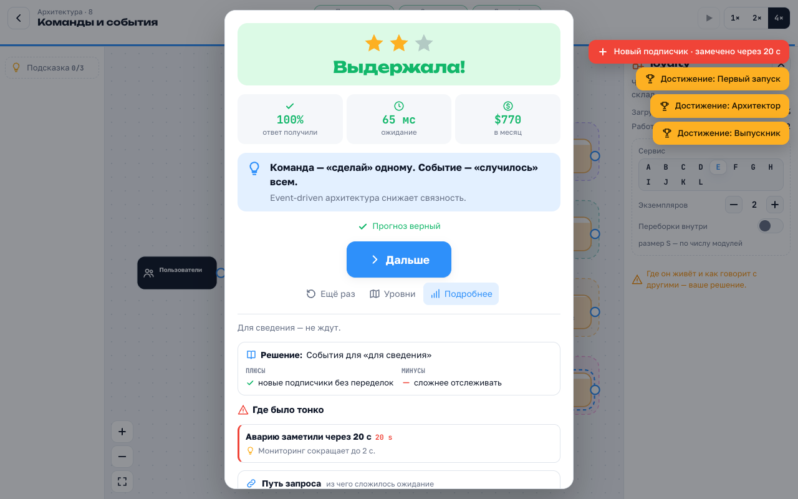

# Аптайм

[🇬🇧 English](README.md) · 🇷🇺 **Русский** · **[▶ Играть](https://esurvanov.github.io/awesome-games/work-programmer/)**

Строишь сервис. Он ломается. Ты чинишь. Игра про работу инженера для тех, кто никогда не программировал:
поток пользователей идёт по трубам, ты ставишь блоки, делаешь ставку, что сломается первым, и смотришь.




| | |
|---|---|
| 🧭 43 уровня | 5 групп: основы → нагрузка → наблюдаемость → платформа → архитектура |
| 🧱 25 блоков | серверы, кэш, база, очередь, брокер, Kubernetes, сокеты, VPN, саги, мониторинг, логи, трейсинг |
| 💥 27 аварий | всплеск, зона, регион, облако, плохой выпуск, сертификат, утечка, боты |
| 🔮 прогноз | перед стартом: что сломается первым |
| 📋 разбор | решение (ADR) с плюсами и минусами, путь запроса, где было тонко |
| 🎲 режимы | задача дня, выживание, песочница · 🌐 русский и английский |

## Запуск

Открыть `index.html` двойным щелчком. Сервер, сборка и библиотеки не нужны; без сети вместо шрифта будет системный.

## Управление

| | Мышь | Палец |
|---|---|---|
| ➕ поставить блок | щелчок или перетаскивание из списка слева | тап |
| 🔗 провести трубу | кружок у блока → другой блок | тап, тап |
| ⚙️ настройки | щелчок по блоку или трубе | тап |
| ▶ запуск · ⏸ пауза | кнопка, `Пробел` | кнопка |
| ⏩ скорость | 1× · 2× · 4× | кнопка |
| 🗑 убрать | `Delete` (не на ходу) | — |
| 🔍 масштаб | колесо, кнопки слева внизу | щипок |

## Устройство

```
index.html         спрайт иконок + корень приложения; части — обычные <script> с реестром L (js/l.js), список — js/manifest.js
js/core.js         пространство имён U, генератор случайных чисел с сидом
js/sim/            поток без DOM: model.js — блоки, связи, цены, очередь Erlang C, трафик;
                   sim.js — шаг симуляции, аварии, масштаб, итог; run.js — прогон без экрана, нагрузочный тест
js/content/        ДАННЫЕ: levels.js — 43 уровня (трафик, аварии, цели, стартовая схема), text.ru.js / text.en.js — все слова
js/render/         board.js — поле на SVG: баки, трубы, группы, точки потока, перетаскивание и связи
js/ui/             i18n.js — язык и схема настроек блоков; app.js — экраны, инспектор, обучение, итог, режимы
js/main.js         сборка: открывает главный экран
css/game.css       вид, светлая и тёмная тема
docs/              architecture/ — устройство (C4, критические пути), page/ — данные страницы игры, screenshots/
tests/             Node + Playwright
```

## Тесты

```sh
cd tests && npm install   # один раз, для браузерных проверок
node levels.test.js       # все 43 уровня и задачи дня: наивная схема проваливается, эталонная проходит
node dbg.js <уровень> [naive|ref]   # загрузка блоков по ходу забега
node ui.smoke.js          # браузер: обучение, уровни, правка на паузе, нагрузочный тест, язык, телефон
node hostile.test.js      # обучение проходится, даже если браузер теряет отпускание кнопки
```
