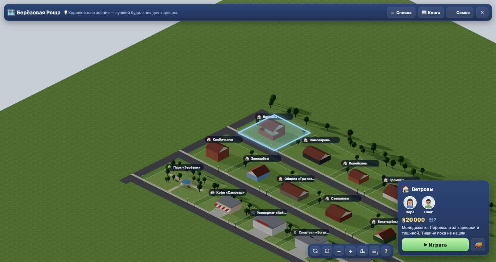

<div align="center">

[🇬🇧 English](README.md) · 🇷🇺 **Русский**

# Житьё

**Браузерная симуляция жизни в духе The Sims 1 — изометрическое 3D в low-poly, целый район с семьями, потребностями, карьерой и отношениями. Ничего не устанавливать, без сборки.**

[](https://esurvanov.github.io/awesome-games/zhitie/)

[](#-запуск)
[](#-запуск)
[](LICENSE)
[](CREDITS.md)
[](#-запуск)


</div>

Переезжайте в **Берёзовую Рощу** — небольшой район из десяти семей, парка, кафе, магазина, спортзала и библиотеки. Возьмите под опеку семью, следите, чтобы все были сыты, отдохнуты и веселы, держитесь за работу, заводите дружбу и романы, обставляйте и достраивайте дом комната за комнатой — всё в low-poly 3D с фиксированной изометрической камерой, как в классике жанра.

Это самостоятельный клон механик, написанный с нуля: никаких товарных знаков, графики, музыки и интерфейса EA — свой визуальный язык (зелёное кольцо-нимб над симом вместо ромба) и своя тарабарщина вместо симлиша.

## ✨ Что внутри

| | | |
|---|---|---|
| 🏘 **Живой район** — 10 семей, между которыми можно переключаться, от молодожёнов до семьи из пяти человек, плюс общественные участки: парк, кафе, магазин, спортзал, библиотека | 🧠 **Потребности и настроение** — голод, бодрость, гигиена, туалет, веселье, общение, комната и комфорт определяют, что сим захочет сделать дальше | 💼 **Карьера и навыки** — 10 карьерных линий, повышения, шесть навыков, растущих с практикой |
| 💞 **Отношения** — дружба, романы, тайные интрижки, семейная вражда; 86 социальных взаимодействий | 🛋 **Режимы «Покупка» и «Стройка»** — 38 предметов мебели в разных стилях, стены, полы, двери, окна, несколько этажей и крыши | 🌗 **Смена дня и ночи** — регулируемая скорость игры, полноценные игровые часы |
| 🎥 **Классическая изометрическая камера** — 4 поворота × 3 уровня приближения, срез стен | 🎨 **Low-poly 3D, всё на CC0** — каждая модель и анимация под лицензией CC0 | 📱 **Работает в любом современном браузере** — чистые ES-модули, `three.js` через CDN, ничего не ставить |

## 📸 Скриншоты

| Район | Внутри дома |
|---|---|
|  |  |

## 🎮 Управление

Как в играх, на которые «Житьё» похоже: клик по симу или предмету открывает круговое меню действий, клик по полу — идти туда.

| | Клавиша |
|---|---|
| Режимы Жизнь / Покупка / Стройка | `F1` / `F2` / `F3` |
| Пауза / продолжить | `P` |
| Скорость игры | `0`–`3` |
| Переключение между членами семьи | `Space` |
| Поворот / масштаб камеры | перетаскивание / колесо, либо кнопки на экране |

## 🚀 Запуск

Игра — статические файлы, без зависимостей и без сборки; `three.js` подключается с CDN через import map.

```bash
./serve.sh        # затем откройте http://localhost:8123
```

Открыть `index.html` напрямую не получится — ES-модулям нужен сервер.

## 🧪 Тесты

```bash
npm test                          # чистая логика, node --test
npm i && node tests/ui-shot.mjs   # Playwright, браузер и скриншоты
```

## 🛠 Внутри

| Файл | Что делает |
|---|---|
| `js/sim/*`, `js/core/tuning.js` | потребности, настроение, выбор действия, очередь, время, деньги, работа, навыки, отношения, соц. взаимодействия |
| `js/world/*` | сетка участка, стены на рёбрах, полы, двери/окна, размещение предметов, комнаты, поиск пути A* |
| `js/render/*` | сцена three.js, изометрическая камера, свет день/ночь, срез стен, анимированные симы, пикинг предметов |
| `js/ui/*`, `js/audio/*` | нижняя панель, полоски потребностей, круговое меню, очередь, переключение режимов, каталог, часы, деньги, уведомления, звук |
| `data/*` | каталог предметов, карьеры, социальные взаимодействия, желания, район и его семьи |

## 📜 Лицензия

Код — MIT, см. [LICENSE](LICENSE). Ассеты — CC0, авторы указаны в [CREDITS.md](CREDITS.md).
